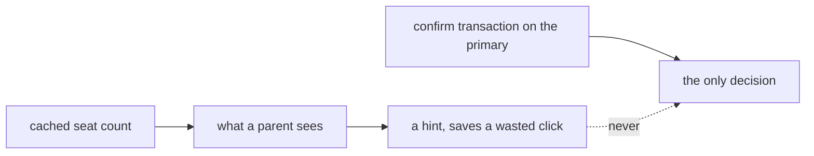
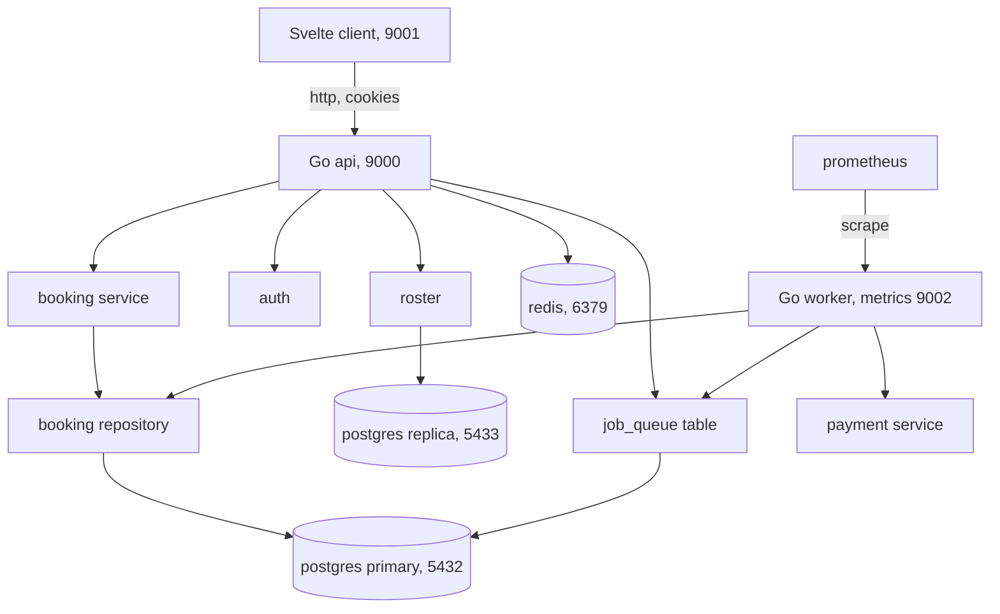
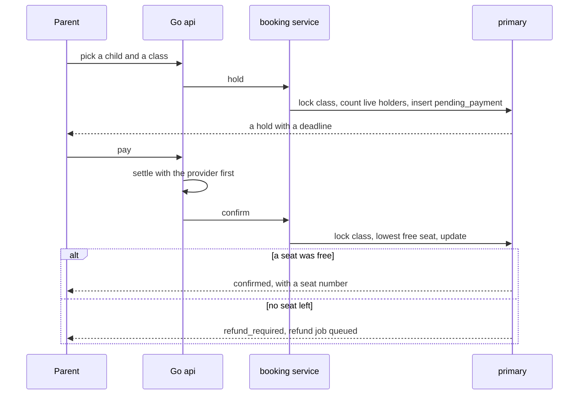
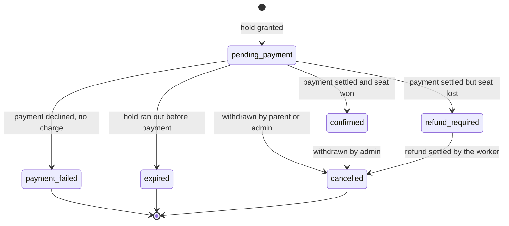
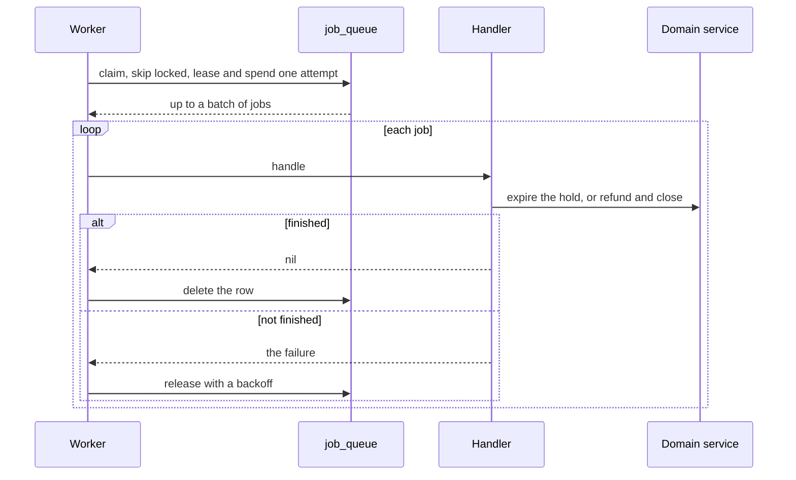
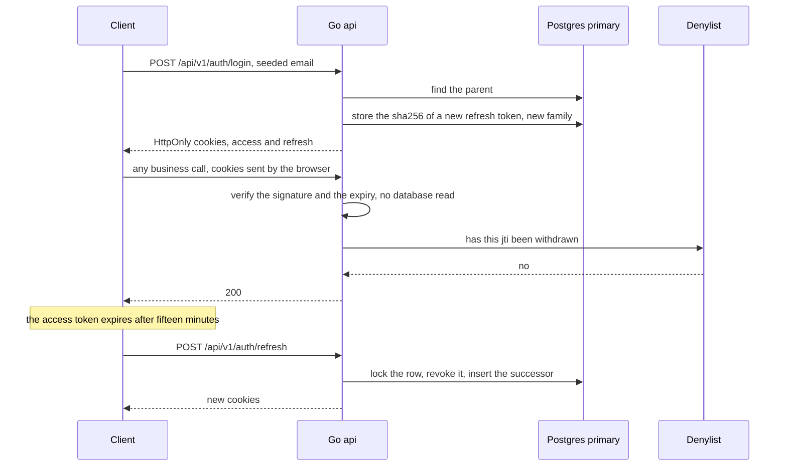
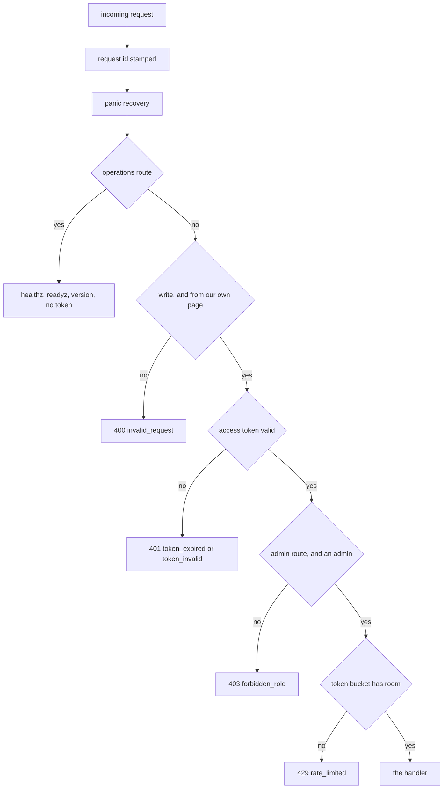
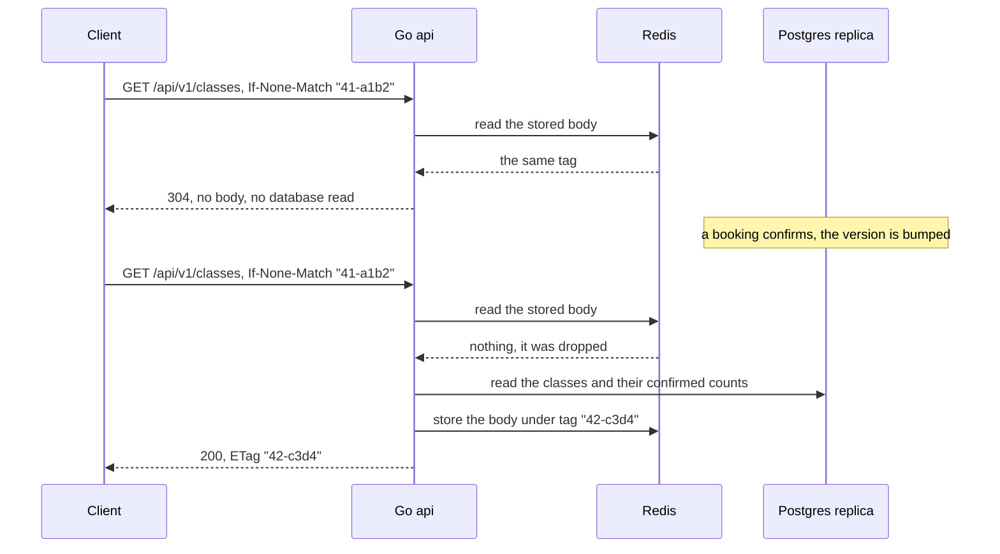
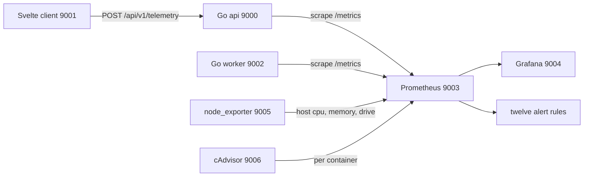
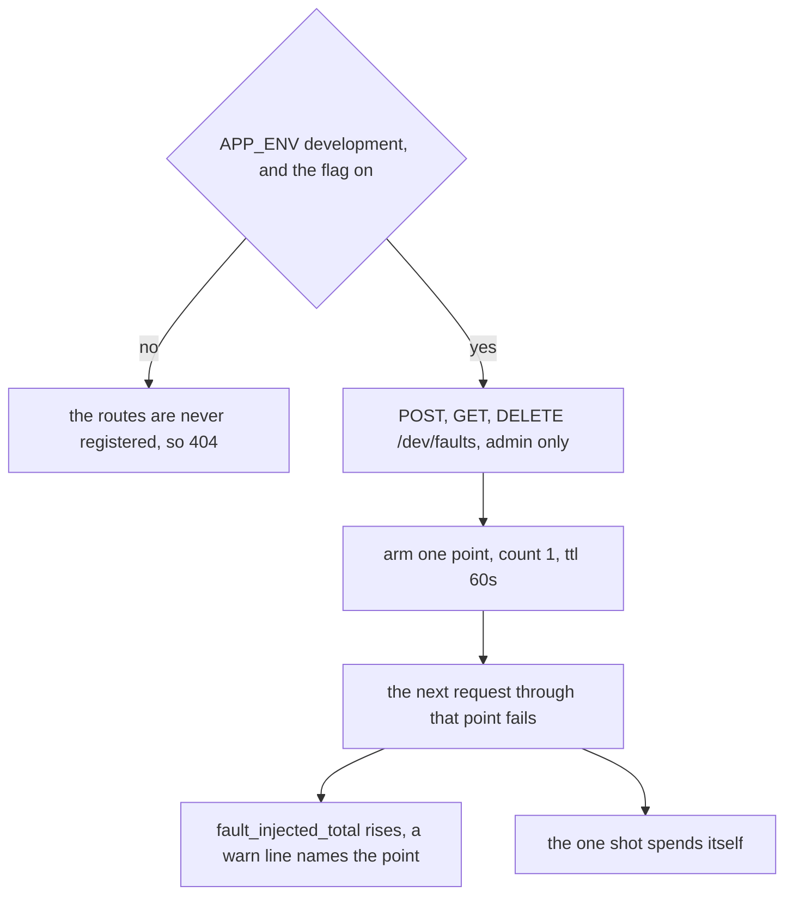

# Backend High Level Design

What the pieces are, where the boundaries fall, and which of them is allowed to
decide anything. Table by table detail is in `LLD.md`, and the reasoning behind
each choice is in `ADR.md`.

 

## The Rule Everything Else Follows

One transaction decides who owns a seat. Every other number this service
produces is advisory, including its own cached counts.

That is what makes caching safe here. Everything cacheable is advisory by
construction, so a stale value can never sell a seat twice.

 

## Components

| component | owns | state today |
| :- | :- | :- |
| api | the http surface, authentication, rate limiting, caching | built |
| booking service | policy: hold lifetime, the per-parent hold cap, the clock | built |
| booking repository | atomicity, and every invariant that has to hold under concurrency | built |
| auth | tokens, rotation, reuse detection, the role check, the four auth routes | built |
| roster | confirmed bookings for a class, for a teacher | built |
| worker | expiring lapsed holds, reconciling refunds | built |
| payment | the charge: a deterministic provider behind the interface a real one would have, and one attempt per idempotency key | built |

 

## Where Each Check Lives

The single most useful table in this document. A check in the wrong layer is
either unenforceable or unhelpful.

| check | layer | why there |
| :- | :- | :- |
| the seat | the confirm transaction, primary | the only place that can be right while two parents act at once |
| one live booking per child per class | a partial unique index | true even from a manual sql edit. The service checks it too, so the parent gets a reason instead of a driver error |
| two bookings never share a seat | a partial unique index | a backstop under the lock, never the mechanism |
| a replayed payment never charges twice | a unique index on booking and idempotency key | the same request arriving twice must produce one charge |
| how long a hold lasts, how many a parent may have | the booking service | policy, not an invariant. It changes without touching the transaction |
| who may act on this booking | api middleware | it needs the token, which the database does not have |
| is this token still believed | api middleware, signature then denylist | the signature costs no database read, and the denylist is what makes a sign out real |
| one refresh token is spent once | the rotation transaction, primary | a read followed by a write lets one stolen token become two sessions |
| did this write come from our own page | api middleware, Origin check on mutations | cookies travel by themselves, so this is what a cookie session costs |
| is the caller a person | api middleware and the write handlers | rate limit, honeypot, fill timer, captcha, all before the repository is touched |
| seat counts on screen | the client, advisory only | stale by the time a parent clicks, and every screen handles the rejection |
| expiring a lapsed hold | the worker | nothing on a request path should depend on a timer |
| sending money back | the worker | it must survive a restart, so it is a queued job, not a deferred call |

 

## The Booking Flow

Three things about this diagram carry the design.

**The hold is not the seat.** It is a place on the payment screen, bounded by
`capacity + hold_allowance` and by a deadline. Granting one decides nothing.

**The payment settles before the confirm runs.** That ordering is what makes
`refund_required` necessary, and ADR-007 explains why the other ordering is
worse.

**The refund job is enqueued in the same transaction that rejected the parent.**
Not after it. A refund that depends on a second write succeeding is a refund
that goes missing exactly when something broke.

 

## The Booking Lifecycle

The transition table is enforced in one place, `internal/booking/status.go`, and
tested pair by pair. Cancelling releases the seat, which is what makes it
available to the next confirm.

 

## Read Routing

Two pools, and they are not interchangeable.

| read | pool | why |
| :- | :- | :- |
| anything inside the confirm transaction | primary | it is the decision |
| a parent reading their own booking straight after acting | primary | read-your-writes. Seeing a stale status after paying looks like the payment was lost |
| a refresh token lookup | primary | a revoked token that still works because of lag is a security hole, not a display quirk |
| the class list and its seat counts | replica | advisory, and lag of a second is invisible |
| the roster before a class starts | replica | read by a teacher minutes ahead, not at the moment of a write |

The replica being down does not make the service unready, because nothing that
decides anything reads from it. It is reported as degraded. The primary or Redis
being down does make it unready.

 

## Failure Behaviour

| dependency down | what still works | what stops |
| :- | :- | :- |
| replica | everything. Advisory reads fall back to the primary | nothing, the service reports degraded |
| redis | booking, paying, confirming | caching and rate limiting, which fail open on reads and closed on writes |
| worker | booking, paying, confirming | lapsed holds are not released and refunds are not sent, which the refund backlog alert is for |
| primary | nothing | the service reports unready and stops taking traffic |

 

## Test Boundaries

The interfaces exist so the fast tiers have something to run against.

| interface | real | fake |
| :- | :- | :- |
| `booking.Repository` | `PostgresRepository` | `MemoryRepository`, invariants under a mutex |
| `payment.Repository` | `PostgresRepository` | `MemoryRepository`, one attempt per key under a mutex |
| `queue.Queue` | `PostgresQueue`, one skip-locked claim statement | `MemoryQueue`, the same rules under a mutex |
| `ratelimit.Limiter` | redis | in memory |
| `cache.Store` | redis | in memory |
| `auth.RefreshStore` | postgres | in memory |
| `payment.Provider` | not built, out of scope | a deterministic mock |

Four tiers run against the fakes in about a second and need nothing installed.
They cannot prove that a lock serialized two transactions, because there is no
transaction in a fake. That is what the fifth tier is for, and both
implementations are held to one shared contract suite so the fake cannot quietly
disagree with the sql.

 

## The Worker

A second process, not a goroutine inside the api. The api can restart or scale
without touching background work, the queue lives in the database so nothing in
flight dies with a process, and a worker falling over shows up as a worker
falling over rather than as slow requests.

Three packages meet here and none of them knows about the others:

| package | knows about |
| :- | :- |
| `queue` | ids, kinds, opaque payloads, leases, attempts. No booking, no seat, no money |
| `booking` and `payment` | their own domain. Neither has ever heard of a job |
| `worker` | both, and nothing else does |

That split is what lets the whole queue be tested with no class, no student, and
no seat in sight, and it keeps the queue out of every request path.

**What a handler returns decides what happens to the job.** `nil` removes it,
including when there turned out to be nothing to do, because a job that arrives
after a parent already paid has succeeded at its purpose. Anything else hands
the job back for another attempt, until its attempts run out and it parks.

**Who schedules the jobs.** `internal/checkout`. It enqueues `expire_hold` when
a hold is granted, at the deadline plus a grace period, and `reconcile_refund`
when a confirm reports `ErrSeatLost`. Both are written after the transaction
they follow rather than inside it, and ADR-037 explains why that order is the
survivable one.

 

## Authentication

Two tokens, and they are different kinds of thing on purpose.

The access token is a JWT. It is stored nowhere, and verifying it is a signature
check and a clock comparison, so the hot path touches no database. That is the
whole reason it was chosen over a session row.

The refresh token is opaque and has a row, and only as a sha256 hash. It rotates
on every use, so there is only ever one live link in a chain, and presenting a
spent one is how a theft becomes visible.

**What is in the token, and what is not.** Six claims: `sub`, `role`, `typ`,
`jti`, `iat`, `exp`. No email, no name, no child, no class. A JWT payload is
base64 rather than encryption, so anybody holding the token reads it, and the
claim set is a closed struct with nowhere to put a seventh field. See ADR-028.

**Why the role is in the token.** Reading it per request would put a database
query back on the path this design took it off. It is refreshed from the
directory on every rotation, so a changed role takes effect within one access
token lifetime rather than at the next sign in.

**Where each piece lives.**

| file | owns |
| :- | :- |
| `claims.go` | what may be in a token, and what a valid claim set is |
| `jwt.go` | signing and verifying, and refusing every algorithm but HS256 |
| `token.go` | minting the opaque refresh token and reducing it to what is stored |
| `store.go` and its two implementations | the refresh token lifecycle, rotation included |
| `directory.go` and its two implementations | who exists: the sign in lookup and the session read |
| `denylist.go` | which access tokens have been withdrawn before their expiry |
| `refresh.go` | rotation, and counting reuse when the store reports it |
| `service.go` | sign in, sign out, and the session read |
| `cookie.go` | the two cookies, their flags, and their paths |
| `middleware.go` | verify, check the denylist, check the role, check the origin |
| `handler.go` | the four routes and their http shape |
| `failure.go` | what each failure looks like on the wire |

**Cost of using cookies.** The browser attaches them by itself, so a write
another site starts would carry a real identity. Two things answer that:
`SameSite=Strict`, which is a browser behaviour, and an Origin check on every
mutation, which does not depend on the browser getting it right.

**Sign out, and what it can and cannot do.** The `jti` goes on a denylist for
exactly the token's remaining life, and the refresh family is revoked, so both
halves of the session stop working. The denylist is in Redis, so a sign out on
one api instance is honoured by every other. A Redis that cannot be read is a
refused request rather than an honoured token: a denylist that cannot say no
must not say yes.

**Sign in is mocked, deliberately.** A seeded email, no password, because the
brief asks for no auth. Everything around it is real, so a password or a
provider later replaces one method.

 

## The Http Surface

Two groups of routes, split on purpose. Operations routes never move, so they
stay unversioned at the root. Business routes carry `/api/v1`, so a breaking
change becomes `/api/v2` rather than a silent contract shift.

**The order is the design.** Authentication comes before the rate limit, and it
has to: a request counted before its identity is known is a request counted
against an address rather than an account, and an address is shared by everyone
behind one office connection.

**Each layer is cheaper than the one below it.** A signature check costs no
database read, the ownership check costs one, the bucket costs one shared store
read, and only then does anything reach a transaction. Simulation 10 walks every
branch and asserts that a refusal at each one leaves the repository untouched.

**Where each thing lives.**

| package | owns |
| :- | :- |
| `httpx` | the routes, the middleware chain, and the one failure envelope |
| `operations` | liveness, readiness, and build identity, all unversioned and open |
| `catalogue` | the class list and its advisory seat counts, from the replica |
| `roster` | who owns a seat in one class, from the replica, admin only |
| `checkout` | the order a hold and a payment happen in, and what is queued |
| `cache` | the etag, the stored body, and the version counter |
| `ratelimit` | the token bucket, as arithmetic and as two implementations |
| `captcha` | the challenge provider's shape, and a deterministic mock |

 

## Caching, And Why It Is Safe Here

Only two documents are cacheable: the class list and one class. Both are
advisory by construction, so a stale copy can cost a parent a wasted click and
can never cost anybody a seat.

The tag carries a version as well as a digest, and ADR-036 explains the case
that needs both: cancelling a booking puts a seat straight back, so the body
becomes byte for byte what it was, and only the counter tells the two apart.

 

## Monitoring

Three layers, because no single one answers every question: what each process
knows about itself, what the machine knows, and what the container runtime
knows.

Layer one costs nothing: the Prometheus client library's process and Go
collectors give cpu, resident memory, file descriptors, goroutines, the heap, and
garbage collection pauses on both binaries. Layer two is node_exporter. Layer
three is cAdvisor, and it is the one target allowed to be absent, because it
reads a container runtime socket and is written against Docker. When it will not
start, layers one and two still answer cpu, memory, and drive, and the dashboard
degrades from per container to host wide. A Go test asserts that degradation
rather than leaving it to be discovered.

The client cannot be scraped. It posts what it saw to `/api/v1/telemetry` and
the api turns those events into series on its own `/metrics`, which is why the
frontend dashboard ships with this stack rather than the other one.

Two rules hold the whole surface together. Every label value comes from a fixed
list written into the code, so no series is ever per booking or per parent,
ADR-042. And redaction happens at the log writer rather than at the call site, so
no code path can forget it, ADR-044.

 

## Proving The Failure Path

A metric nobody has ever seen move is a decoration, and an alert nobody has ever
seen fire is worse, because it is mistaken for coverage.

Five named points can be made to fail on demand, each at exactly one place in the
real code path and each simulating a failure that can genuinely happen: the
confirm transaction breaking before its commit, the class lock timing out, the
payment provider becoming unreachable, a queue job blowing up, and Redis going
away.

The guards are in ADR-045 and the reason it is a runtime route rather than a
build tag is there too. `fault_injection_enabled` is published either way, so the
dashboard's first row says plainly whether this stack can be broken on purpose.

 

## What Is Not Here Yet

Everything above marked with a phase. The compose file gains a service in the
phase that builds it, so it never references something that cannot start.
Progress is in `phase-track.md`.
