# Backend Test Diagram

Every test in this stack, what it proves, and the command that runs that one
file on its own. `how-to.md` has the whole-suite commands, this file is the
index underneath them.

Run everything from `backend/` unless a line says otherwise. The frontend has
its own copy of this file at `frontend/tests-and-diagram.md`.

<br>

## What Runs What

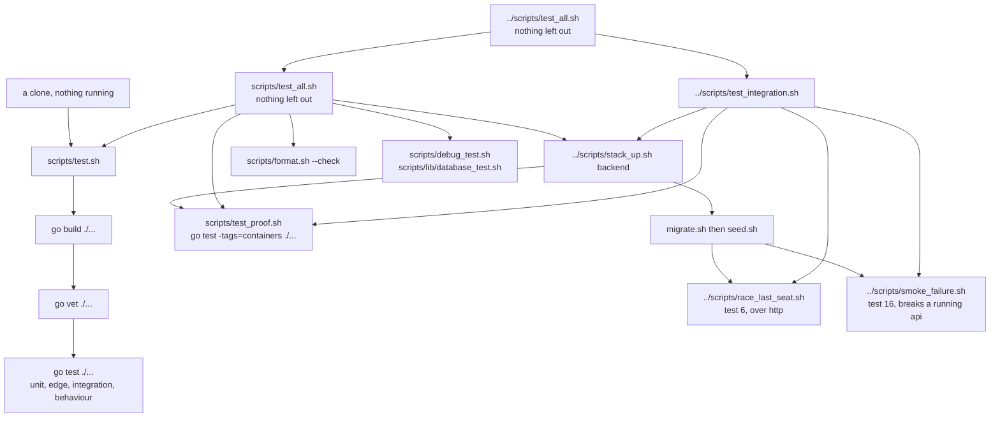

The left branch needs nothing. The right branch needs containers. That split is
the whole point of the tiers: a reviewer with no Docker can still run four
tiers out of five and see them pass, and `scripts/test.sh` on its own is exactly
that left branch.

`scripts/test_all.sh` is this stack's own command and reaches across the line,
which is why it is the one that says the backend is green. It raises a stack when
there is none, applies the schema, seeds an empty database, and takes the stack
down again only if it started it. The schema step is not a formality: most of
these tests build a scratch schema of their own, but the read routing proof reads
the real tables, so against an unmigrated database it fails with
`relation "trial_classes" does not exist`, which reads as a broken test rather
than an unapplied migration.

`../scripts/test_integration.sh` is the one that also runs tests 6 and 16.
`../scripts/test_all.sh` at the root is every one of these together, and starts a
single stack that each step underneath reuses.

<br>

## The Five Tiers

| tier | what a case in it asks | needs |
| :- | :- | :- |
| unit | one function, one answer | nothing |
| edge | the same function at its boundaries and its refusals | nothing |
| integration | two or more parts wired together, over fakes | nothing |
| behaviour | a whole scenario end to end, over fakes | nothing |
| proof | the same claim against real Postgres and real Redis | the backend stack |

The tier is written into the case name, so a run states its own tier:

```sh
go test -v ./internal/booking/ 2>&1 | grep 'edge:'
```

The four fake tiers take about a second. The proof tier takes a few seconds and
works inside a throwaway schema per test, so it can run against the same
database a demo is being clicked through.

<br>

## Running One Test

Go selects tests by package and by name, never by file. So every command in the
index below names the package and the tests that live in that one file:

```sh
go test ./internal/booking/                                      # one package
go test -run '^(TestSimulation01DuplicateBookingRejected)$' ./internal/booking/
go test -v -run '^(TestSimulation01DuplicateBookingRejected)$' ./internal/booking/
```

`-v` prints every case with its tier, which is the fastest way to read what a
file actually covers.

A file whose name ends `_containers_test.go` carries a build tag, is invisible
to a plain `go test`, and needs the stack up:

```sh
../scripts/stack_up.sh backend
go test -tags=containers -run '^(TestSimulation04ParallelConfirmsOnOneFreeSeat)$' ./internal/booking/
```

<br>

## The Tests

Sixteen scenarios, numbered once and referred to by number everywhere else in
this repository. Twelve are Go tests, two are proofs on real Postgres, and two
are scripts against a running stack.

<br>

### Test 1: duplicate booking

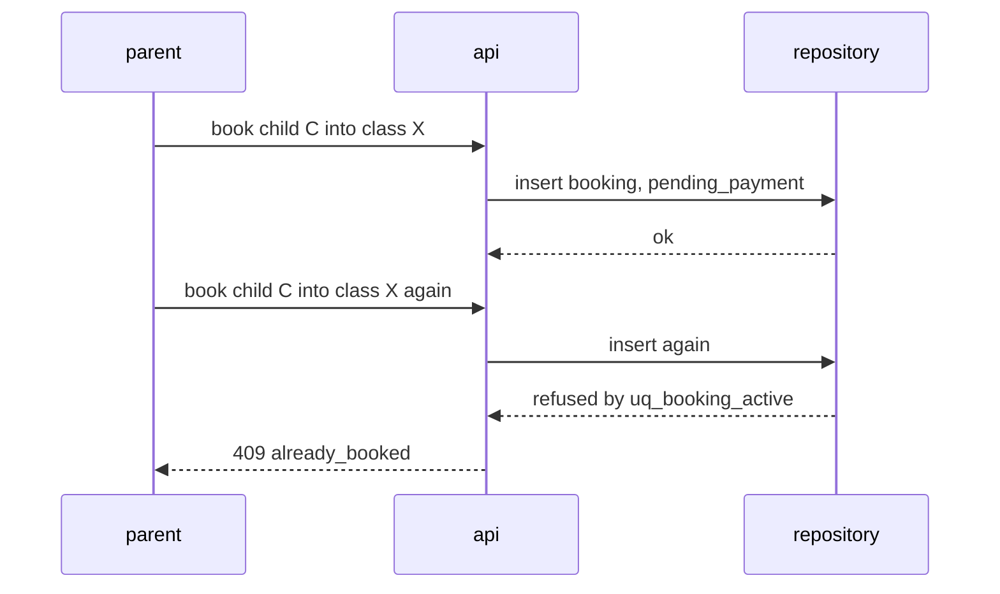

Reading it:

1. A parent books child C into class X.
2. The api writes one booking row, in `pending_payment`.
3. The same parent books the same child into the same class again.
4. The second insert reaches the database and `uq_booking_active` refuses it.
5. The parent is answered 409 `already_booked`, and nothing was written.

Proves: exactly one booking exists for that child and class, the second request
leaves nothing behind, and a cancellation frees that child to book again.

```sh
go test -v -run '^(TestSimulation01DuplicateBookingRejected)$' ./internal/booking/
```

<br>

### Test 2: payment failure never reaches the roster

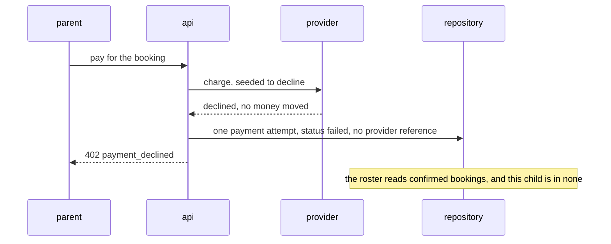

Reading it:

1. A parent pays for a booking, and this card is seeded to decline.
2. The api asks the provider to charge, and the provider declines. No money moved.
3. The api writes one payment attempt with status `failed` and no provider
   reference.
4. The parent is answered 402 `payment_declined`.
5. The confirm transaction never runs, so the roster, which reads confirmed
   bookings, does not carry this child.

Proves: one failed attempt row, no seat assigned, and an empty roster, because
a decline stops the sequence before the confirm transaction runs. A second case
settles a payment and watches it reach the roster, so the first one is proving
something rather than reading an empty table.

```sh
go test -v -run '^(TestSimulation02PaymentFailureNeverReachesTheRoster)$' ./internal/payment/
```

<br>

### Test 3: the capacity boundary

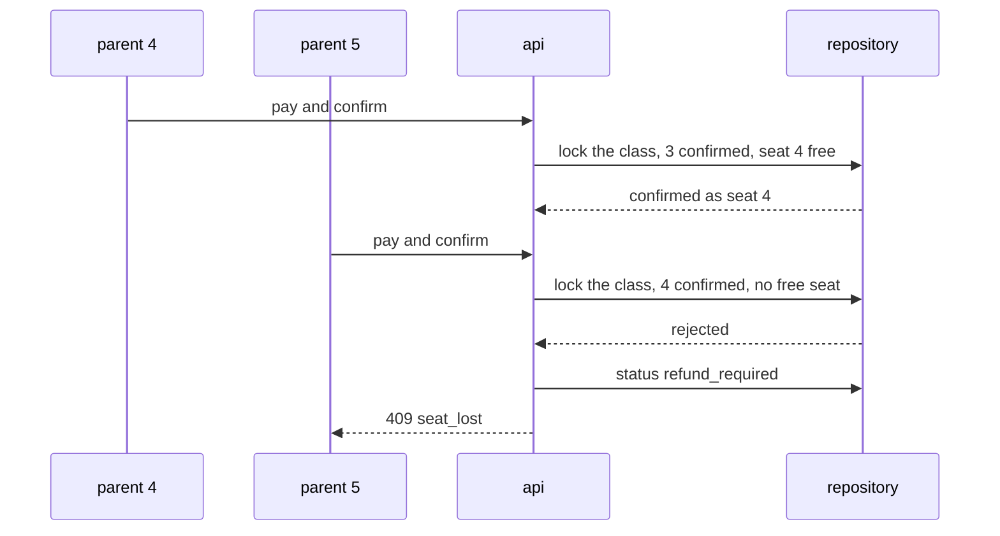

Reading it:

1. Parent 4 pays, and the api opens the confirm transaction.
2. The class row is locked: 3 confirmed, so seat 4 is free.
3. Parent 4 is confirmed as seat 4, and the class is now full.
4. Parent 5 pays, and the api locks the same row: 4 confirmed, no seat left.
5. The confirm is rejected, and that booking is moved to `refund_required`.
6. Parent 5 is answered 409 `seat_lost`. Their money moved, so a refund is owed.

Proves: exactly four confirmed, seats 1 to 4, the fifth parent left in
`refund_required` rather than holding a seat that does not exist, and that
booking keeping its audit trail.

```sh
go test -v -run '^(TestSimulation03CapacityBoundaryAtThreeConfirmed)$' ./internal/booking/
```

<br>

### Tests 4 and 5: the race, on real Postgres

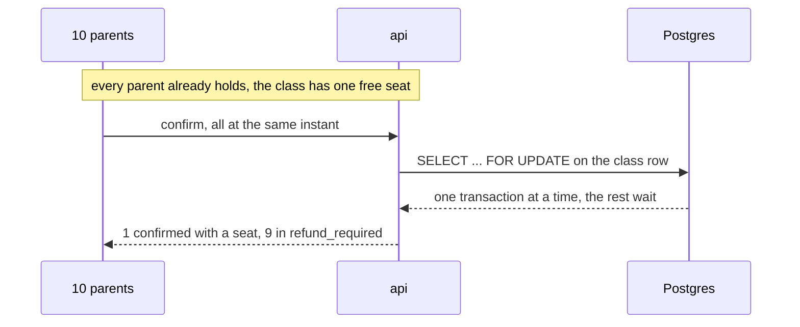

Reading it:

1. Ten parents already hold, and the class has one free seat.
2. All ten send confirm at the same instant.
3. Each confirm opens `SELECT ... FOR UPDATE` on the same class row.
4. Postgres lets one transaction through at a time, and the rest wait at the
   lock rather than reading a count nobody is holding still.
5. The first one out takes the seat. The other nine find none left and end in
   `refund_required`.

This is the pair the four fake tiers cannot give. A fake repository proves the
service calls the right things in the right order, and cannot prove that
`SELECT ... FOR UPDATE` serializes two transactions, because there is no
transaction to serialize.

Test 4 is ten parents on one free seat. Test 5 is twenty parents on
an empty four seat class, and also proves `uq_seat_taken` never fired: every
loser ends in `refund_required`, and a unique violation would have rolled its
transaction back and left that booking in `pending_payment` instead.

```sh
../scripts/stack_up.sh backend
go test -v -tags=containers -run '^(TestSimulation04ParallelConfirmsOnOneFreeSeat|TestSimulation05ParallelConfirmsOnAnEmptyFourSeatClass)$' ./internal/booking/
```

<br>

### Test 6: the last seat, over http

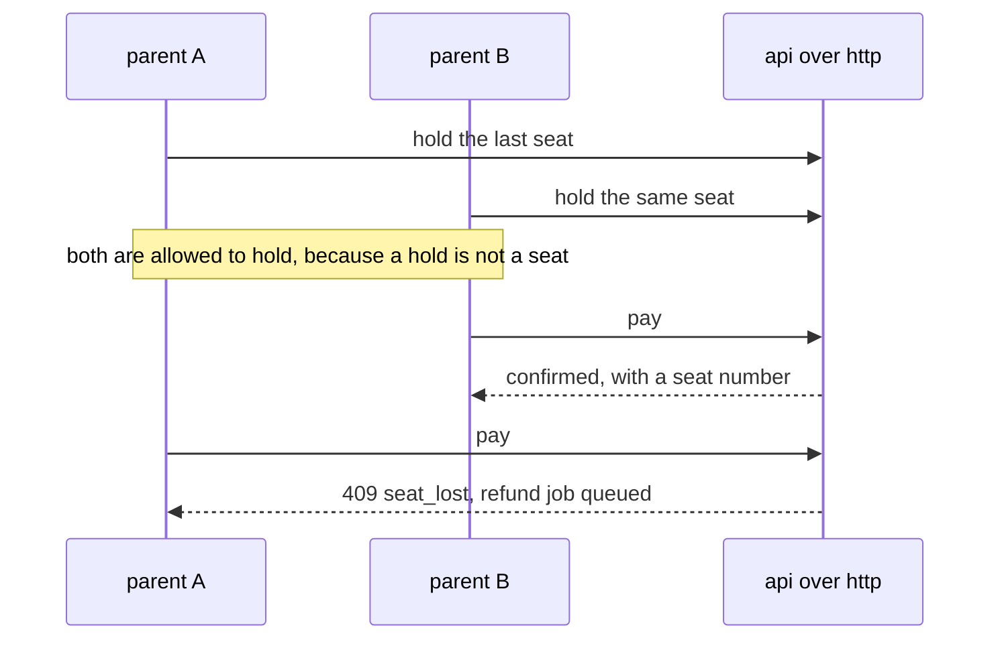

Reading it:

1. Parent A holds the last seat and goes to pay.
2. Parent B holds the same seat, which the hold allowance permits, because a
   hold is not a seat.
3. Parent B pays first, and the confirm transaction hands them the seat number.
4. Parent A pays, and by then the seat is gone.
5. Parent A is answered 409 `seat_lost`, and a refund job is queued naming them.

The brief's scenario against a live system, with cookies, exactly as a browser
does it. It asserts against the database afterwards as well as the http
answers: one seat handed out, two payments taken and settled, an audit line
each, and a refund job naming the parent who lost, or the worker having already
run it.

```sh
../scripts/stack_up.sh backend
scripts/migrate.sh
scripts/seed.sh
../scripts/race_last_seat.sh
```

The seeded seat is gone once that has run. `../scripts/race_last_seat.sh
--fresh-class` races a throwaway class instead, made and then deleted for the
run, which is how this test goes twice.

<br>

### Test 7: hold expiry by the worker

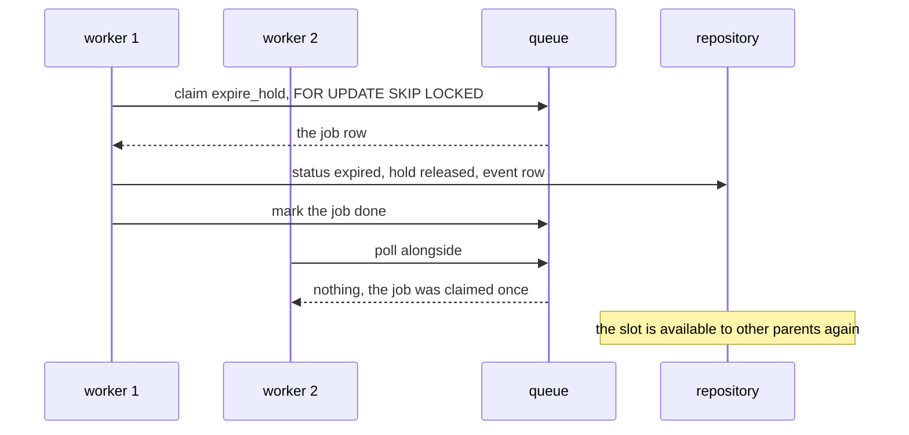

Reading it:

1. Worker 1 claims an `expire_hold` job with `FOR UPDATE SKIP LOCKED`.
2. The queue hands it that one job row.
3. Worker 1 sets the booking to `expired`, releases the hold, and writes the
   event row.
4. Worker 1 marks the job done.
5. Worker 2 polls at the same moment and is handed nothing, because the row was
   claimed once and skipped rather than waited on.
6. The slot is free for another parent.

Proves: the booking becomes `expired`, the slot frees up, and a second worker
polling at the same time claims nothing.

```sh
go test -v -run '^(TestSimulation07HoldExpiryByTheWorker)$' ./internal/worker/
```

<br>

### Test 8: refund reconciliation

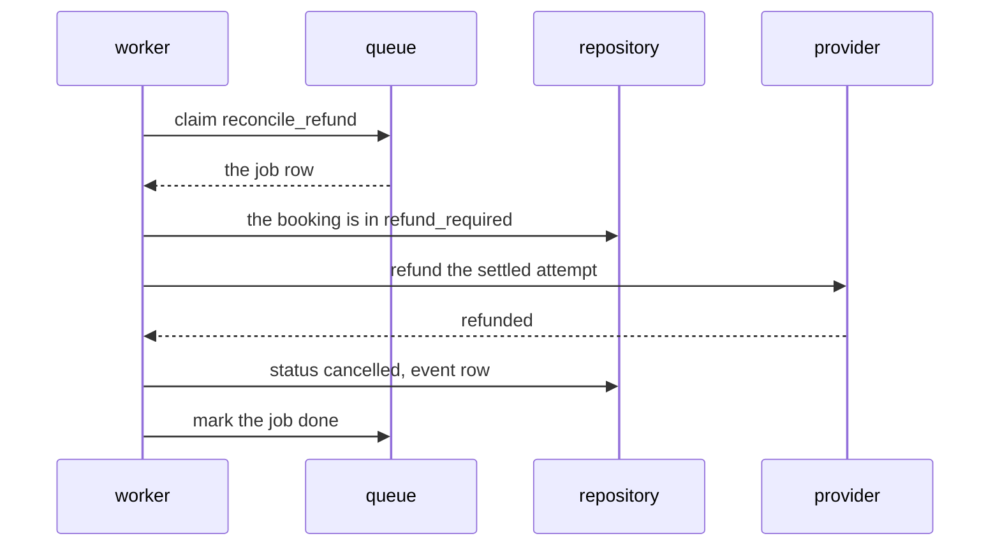

Reading it:

1. The worker claims a `reconcile_refund` job.
2. It reads the booking and finds it still in `refund_required`.
3. It asks the provider to refund the attempt that settled.
4. The provider refunds, and the reference comes back.
5. Only then does the worker set the booking to `cancelled` and write the event
   row. Refund first, close second: a booking closed before the money moved
   would look settled while the parent is still out of pocket.
6. The job is marked done.

Proves: the booking moves to `cancelled`, the refund reference is recorded, a
replay of the same job refunds nothing more, and a provider that cannot be
reached leaves the job for another attempt. The parent refunded here is the
one from test 5: they paid for a seat that was gone by the time their
confirm ran.

```sh
go test -v -run '^(TestSimulation08RefundReconciliation)$' ./internal/worker/
```

<br>

### Test 9: idempotent payment replay

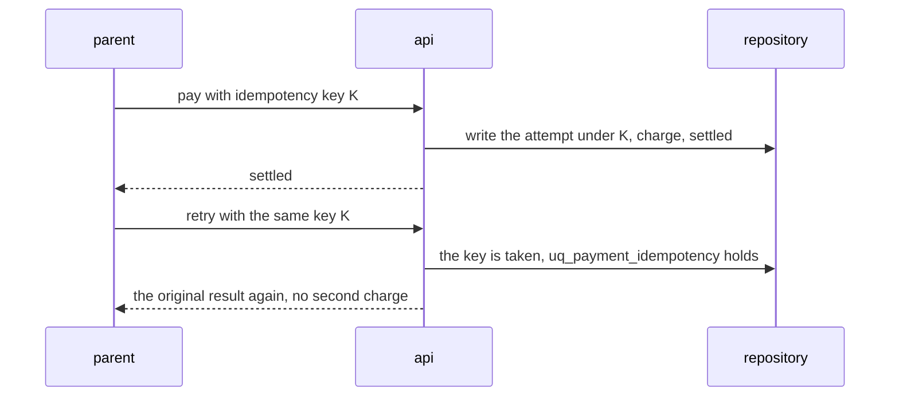

Reading it:

1. A parent pays, carrying idempotency key K.
2. The api writes the attempt under K, charges, and the charge settles.
3. The parent is told it settled.
4. The parent retries with the same key K, which is what a refreshed page does.
5. `uq_payment_idempotency` holds, so that key cannot be written a second time.
6. The stored result is returned again, and the provider is never asked to
   charge twice.

Proves: one `payment_attempts` row, one charge at the provider, and an
identical answer from both calls. A replayed decline replays the decline rather
than charging, and a different key against the same booking is a second charge,
which is what makes the key the thing being tested rather than the booking.

```sh
go test -v -run '^(TestSimulation09IdempotentPaymentReplay)$' ./internal/payment/
```

The same claim under real parallelism is a proof case, ten calls sharing one
key:

```sh
../scripts/stack_up.sh backend
go test -v -tags=containers -run '^(TestOneKeyChargesOnceUnderRealConcurrency)$' ./internal/payment/
```

<br>

### Test 10: the bot prevention layers

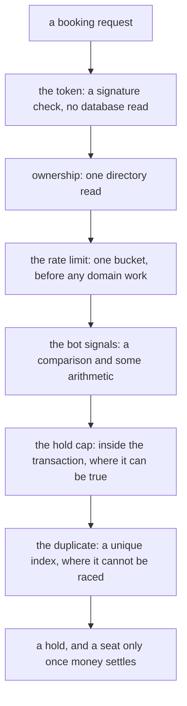

Reading it, top to bottom, and the order is the point:

1. A booking request arrives.
2. The token is checked, which is a signature check and no database read.
3. Ownership is checked, which is one directory read.
4. The rate limit takes one bucket, before any domain work happens.
5. The bot signals are a comparison and some arithmetic.
6. The hold cap is checked inside the transaction, which is the only place it
   can be true.
7. The duplicate is caught by a unique index, where it cannot be raced.
8. What is left is a hold, and a seat only once money has settled.

Each layer costs more than the one above it, so the commonest refusal is the
cheapest one to make.

The question is not whether a rate limiter exists. It is whether a request
meets the layers in that order, cheapest first, and whether each one refuses
with a typed code a client can act on. The flood case also proves a refusal
never reached storage.

```sh
go test -v -run '^(TestSimulation10BotPreventionLayers)$' ./internal/httpx/
```

<br>

### Test 11: a conditional request, served without a database read

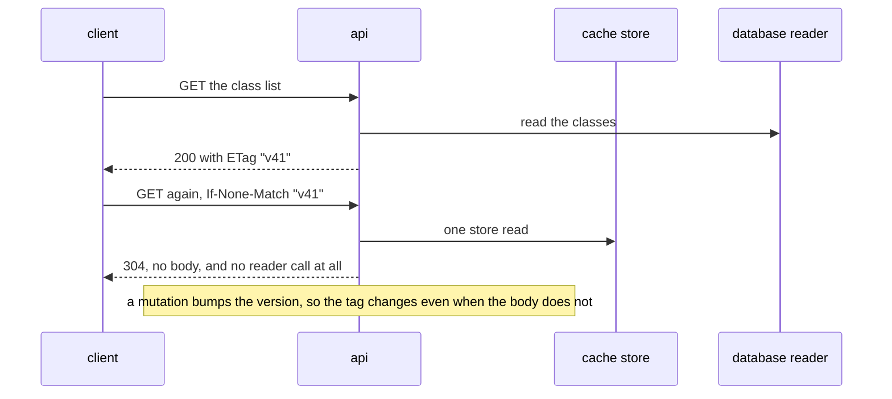

Reading it:

1. A client asks for the class list.
2. The api reads the classes and answers 200, with the ETag `"v41"`.
3. The client asks again, carrying `If-None-Match: "v41"`.
4. The api makes one store read and nothing else.
5. It answers 304 with no body, and the database reader was never called.
6. A mutation bumps the version, so the tag changes even when the body does not,
   which is what stops a client trusting a stale answer.

Measured rather than asserted: the reader counts its own calls, so "zero
database queries" is provable instead of plausible. A client arriving with no
tag at all is served the stored body, still without a database read.

```sh
go test -v -run '^(TestSimulation11ConditionalRequestServedWithoutADatabaseRead)$' ./internal/httpx/
```

<br>

### Test 12: readiness reflects reality

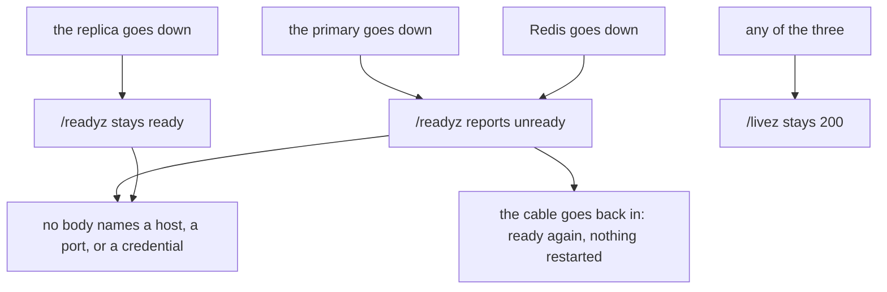

Reading it, one dependency at a time:

1. The replica goes down, and `/readyz` stays ready.
2. The primary goes down, and `/readyz` reports unready.
3. Redis goes down, and `/readyz` reports unready as well.
4. Through all three, `/livez` stays 200, because the process itself is alive
   and restarting it would fix nothing.
5. The dependency comes back, and readiness returns on its own with nothing
   restarted.
6. No answer along the way names a host, a port, or a credential.

A downed replica keeps the service in rotation, because every deciding read
already goes to the primary and taking a working service out costs an outage
nobody needed. A downed primary or Redis takes it out, because neither a seat
nor a withdrawn token can be decided without them.

```sh
go test -v -run '^(TestSimulation12ReadinessReflectsReality)$' ./internal/operations/
```

<br>

### Test 13: refresh rotation and reuse detection

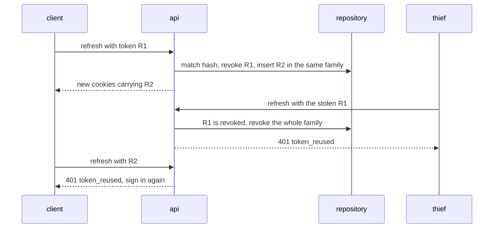

Reading it:

1. The client refreshes with token R1.
2. The api matches the hash, revokes R1, and inserts R2 into the same family.
3. The client is given new cookies carrying R2.
4. A thief refreshes with the stolen R1.
5. R1 is already revoked, so the whole family is revoked and the thief is
   answered 401 `token_reused`.
6. The real parent refreshes with R2 and is signed out too. Two parties held R1
   and this service cannot tell which one was the thief, so it ends both.

Proves: R1 works exactly once, the family is revoked on reuse, the counter
increments, and the real parent is signed out too. That is the correct trade
for a stolen token: two parties hold R1, one is a thief, and this service
cannot tell which.

```sh
go test -v -run '^(TestSimulation13RefreshRotationAndReuseDetection)$' ./internal/auth/
```

The same rotation under real parallelism, eight callers on one token:

```sh
../scripts/stack_up.sh backend
go test -v -tags=containers -run '^(TestOneRefreshTokenIsSpentOnceUnderRealParallelism)$' ./internal/auth/
```

<br>

### Test 14: nothing sensitive leaks

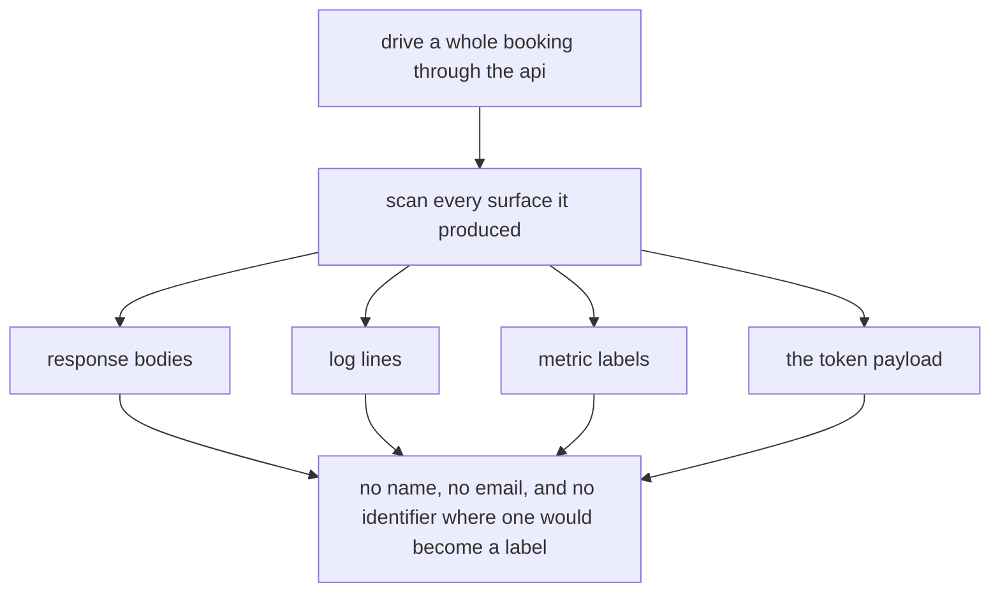

Reading it:

1. A whole booking is driven through the api, so there is real output to look
   at rather than a fixture.
2. Every surface that run produced is then scanned.
3. The four surfaces are the response bodies, the log lines, the metric labels,
   and the token payload.
4. Each one has to carry no name, no email, and no identifier that would become
   a metric label.

The seeded names are listed by hand in the test, because a name has no shape
and nothing can pattern match one. A JWT payload is base64 and not encryption,
which is why the claim set is the first thing the case reads.

```sh
go test -v -run '^(TestSimulation14NothingSensitiveLeaks)$' ./internal/httpx/
```

<br>

### Test 15: the confirm transaction breaks

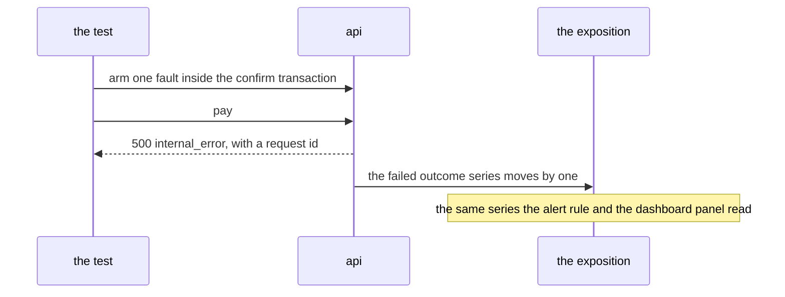

Reading it:

1. The test arms one fault inside the confirm transaction.
2. It pays, which is what runs that transaction.
3. The api answers 500 `internal_error` with a request id, and nothing else.
4. The failed outcome series moves by one, while the two healthy outcomes stay
   where they were.
5. That is the same series the alert rule and the dashboard panel read, so this
   is what makes them worth anything.

Proves the failure path itself: a broken transaction consumes no seat and
leaves the booking holding, the parent is told a code and a request id and
nothing else, and only the failed series moves while the two healthy outcomes
stay where they were. The retry with the same key is then confirmed, which is
the backend half of frontend test 17.

```sh
go test -v -run '^(TestSimulation15TheCoreTransactionFails)$' ./internal/httpx/
```

<br>

### Test 16: the same break, on a running stack

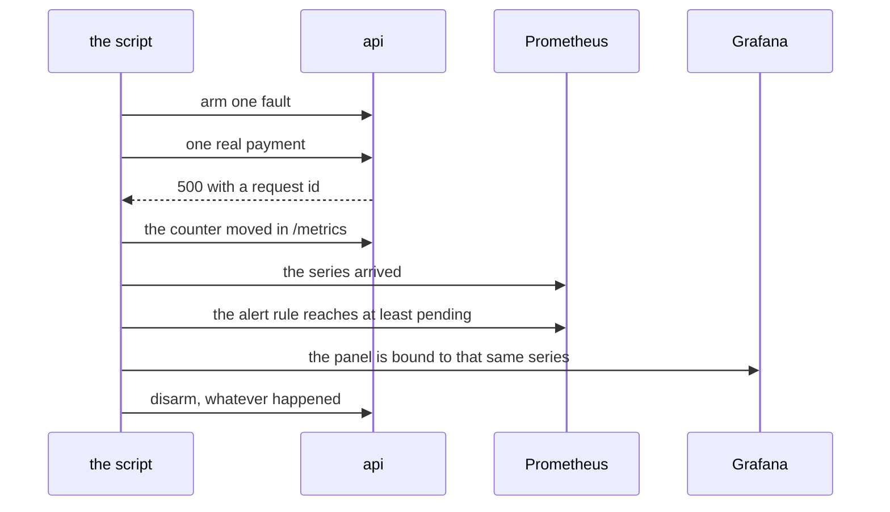

Reading it:

1. The script arms one fault on the running api.
2. It drives one real payment through it, over http and with cookies.
3. The parent is answered 500 with a request id.
4. It reads the api's own `/metrics` and finds the counter moved by one.
5. It waits for that series to arrive in Prometheus.
6. It waits for the alert rule to reach at least pending.
7. It checks the dashboard panel is bound to that same series.
8. It disarms the fault on the way out, whatever happened above, because a stack
   left broken by a script that died is the worst outcome available here.

Proves: the parent is told the service broke, the booking is still
`pending_payment`, no seat was consumed, and the counter moved by exactly one,
all the way through to the panel.

A metric nobody has seen move is a decoration, and an alert nobody has seen
fire is worse, because it gets mistaken for coverage. This is the script that
settles both. It is classed destructive although it deletes nothing: it breaks
a running system on purpose, so it prints a manifest and asks `y/N` first.

```sh
../scripts/stack_up.sh backend
scripts/migrate.sh
scripts/seed.sh
APP_ENV=development ../scripts/smoke_failure.sh --dry-run   # the plan only
APP_ENV=development ../scripts/smoke_failure.sh
```

<br>

## Every Other Test, By Package

One line per file: the tiers its own cases declare, what it covers, and the
command for that file alone. A file that runs a shared contract also runs that
contract's tiers.

The tests above are not repeated here.

### cmd

```sh
# api/main_test.go (unit, edge, behaviour): the port is taken before anything says it is
# serving, the listener answers from inside its own container, the build identity has a home
go test -run '^(TestTheBuildIdentityHasSomewhereToBeStamped|TestTheListenerIsReachableFromItsOwnContainer|TestThePortIsTakenBeforeAnythingSaysItIsServing)$' ./cmd/api/

# worker/main_test.go (unit, edge, behaviour): the same for the metrics port, plus the refund
# log line carrying nothing about a person
go test -run '^(TestTheBuildIdentityHasSomewhereToBeStamped|TestTheMetricsListenerIsReachableFromItsOwnContainer|TestTheMetricsPortIsTakenBeforeTheWorkerAnnouncesItself|TestTheRefundLineCarriesNothingAboutAPerson)$' ./cmd/worker/
```

### internal/auth

```sh
# claims_test.go (unit, edge): what a claim set must carry, when it counts as expired,
# and the roles that exist
go test -run '^(TestClaimsExpiry|TestClaimsValidation|TestKnownRoles)$' ./internal/auth/

# cookie_test.go (unit, edge, integration): writing the session cookies, clearing them,
# and reading one back
go test -run '^(TestClearingTheSessionCookies|TestReadingACookie|TestWritingTheSessionCookies)$' ./internal/auth/

# denylist_memory_test.go (unit, edge, integration): a withdrawn access token stays withdrawn
go test -run '^(TestTheMemoryDenylist)$' ./internal/auth/

# directory_contract_test.go (edge, integration): the account lookup contract itself. It has no
# tests of its own, it is run by the two files below
go test -run '^(TestTheMemoryDirectoryHoldsNothingItShouldNot|TestTheMemoryDirectoryHonoursTheContract)$' ./internal/auth/

# directory_memory_test.go (edge): the memory directory honours that contract and holds
# nothing it should not
go test -run '^(TestTheMemoryDirectoryHoldsNothingItShouldNot|TestTheMemoryDirectoryHonoursTheContract)$' ./internal/auth/

# failure_detail_test.go (behaviour, edge, integration): what is recorded behind a refused sign in
go test -run '^(TestRecordingTheFailureBehindARefusedSignIn)$' ./internal/auth/

# handler_test.go (behaviour, edge, integration): the login, session, refresh, and logout
# routes, and how the handler is built
go test -run '^(TestHandlerConstruction|TestTheLoginRoute|TestTheLogoutRoute|TestTheRefreshRoute|TestTheSessionRoute)$' ./internal/auth/

# jwt_test.go (unit, edge): building a signer, sign and verify, and the encoded payload
# carrying nothing sensitive
go test -run '^(TestSignAndVerify|TestSignerConstruction|TestTheEncodedPayloadCarriesNothingSensitive)$' ./internal/auth/

# middleware_test.go (behaviour, edge, integration): authenticating a request, requiring a role,
# and checking the origin of a write
go test -run '^(TestAuthenticatingARequest|TestCheckingTheOrigin|TestGuardConstruction|TestRequiringARole)$' ./internal/auth/

# password_test.go (edge): hashing a password and verifying one, argon2id
go test -run '^(TestHashPassword|TestVerifyPassword)$' ./internal/auth/

# refresh_test.go (unit, edge, integration, behaviour): rotating one refresh token
go test -run '^(TestRotatingARefreshToken)$' ./internal/auth/

# service_test.go (unit, edge, integration, behaviour): signing in, signing out, the session
# read, and settings the service refuses to start with
go test -run '^(TestServiceConstruction|TestSigningIn|TestSigningOut|TestTheSessionRead)$' ./internal/auth/

# store_contract_test.go (behaviour, edge, integration): the refresh store contract itself,
# run by the memory and postgres files
go test -run '^(TestTheMemoryRefreshStoreHonoursTheContract|TestTheMemoryRefreshStoreSpendsATokenOnce)$' ./internal/auth/

# store_memory_test.go (edge): the memory refresh store honours the contract and spends a
# token exactly once
go test -run '^(TestTheMemoryRefreshStoreHonoursTheContract|TestTheMemoryRefreshStoreSpendsATokenOnce)$' ./internal/auth/

# store_postgres_containers_test.go (proof): the postgres store and directory honour the same
# contract, and one token is spent once under real parallelism. Needs the stack
go test -tags=containers -run '^(TestOneRefreshTokenIsSpentOnceUnderRealParallelism|TestThePostgresDirectoryHonoursTheContract|TestThePostgresRefreshStoreHonoursTheContract)$' ./internal/auth/

# token_test.go (unit, edge): minting an opaque refresh token, and hashing it for storage
go test -run '^(TestRefreshTokenHashing|TestRefreshTokenMinting)$' ./internal/auth/
```

### internal/booking

```sh
# errors_test.go (unit, edge): every failure is distinct, and no message leaks what it should not
go test -run '^(TestEveryFailureIsDistinct|TestNoFailureMessageLeaksSomethingItShouldNot)$' ./internal/booking/

# faults_test.go (unit, edge, integration, behaviour): the confirm path under each injected fault
go test -run '^(TestConfirmUnderInjectedFaults)$' ./internal/booking/

# hold_test.go (unit, edge): how many parents may hold at once, and which side of a deadline
# an instant falls on
go test -run '^(TestAHoldDeadlineFallsOnTheExpiredSide|TestAHoldDeadlineIsStampedFromTheGivenInstant|TestMaxHoldersIsCapacityPlusAllowance)$' ./internal/booking/

# repository_contract_test.go (behaviour, edge, integration): the repository contract itself,
# run by the memory and postgres files
go test -run '^(TestTheMemoryRepositoryHonoursTheContract)$' ./internal/booking/

# repository_memory_test.go (integration): the memory repository honours the contract, the
# decline and worklist contract, the parent bookings contract, and is safe to share
go test -run '^(TestTheMemoryRepositoryHonoursTheContract|TestTheMemoryRepositoryHonoursTheDeclineAndWorklistContract|TestTheMemoryRepositoryHonoursTheParentBookingsContract|TestTheMemoryRepositoryIsSafeToShare)$' ./internal/booking/

# repository_postgres_containers_test.go (edge, proof): the same three contracts against real
# Postgres, and a malformed identifier refused rather than searched for. Needs the stack
go test -tags=containers -run '^(TestAMalformedIdentifierIsRefusedRatherThanSearchedFor|TestThePostgresRepositoryHonoursTheContract|TestThePostgresRepositoryHonoursTheDeclineAndWorklistContract|TestThePostgresRepositoryHonoursTheParentBookingsContract)$' ./internal/booking/

# seat_test.go (edge): the lowest free seat is the one handed out, including at the top of
# the smallint range
go test -run '^(TestTheSeatPickerReturnsTheLowestFreeSeat|TestTheSeatPickerSurvivesTheTopOfTheSmallintRange)$' ./internal/booking/

# service_test.go (unit, edge): the policy carried into a hold, an incomplete request never
# reaching storage, a parent's list scoped before it is read, seats remaining never negative
go test -run '^(TestACancellationCarriesWhoDidItAndWhy|TestAHoldCarriesThePolicyToTheRepository|TestAnExpiryIsJudgedAgainstTheServiceClock|TestAnIncompleteRequestNeverReachesStorage|TestAParentsOwnListIsScopedBeforeItIsRead|TestSeatsRemainingIsAdvisoryAndNeverNegative|TestTheServiceRefusesSettingsItCannotWorkWith)$' ./internal/booking/

# status_test.go (unit, edge): every allowed transition, every refused one, the terminal
# statuses, and live matching the partial index in the database
go test -run '^(TestEveryAllowedTransitionIsAccepted|TestEveryDisallowedTransitionIsRefused|TestLiveMatchesTheDatabaseIndex|TestTerminalStatusesHaveNoWayOut)$' ./internal/booking/

# transaction_counter_test.go (unit, edge, integration): a transaction is sorted into one of
# three outcomes, and the names cover every transaction there is
go test -run '^(TestATransactionIsSortedIntoOneOfThreeOutcomes|TestTheNamesHandedOutCoverEveryTransaction|TestTheRepositoryCountsOnlyWhenItWasGivenACounter)$' ./internal/booking/

# transaction_counter_containers_test.go (proof): a real transaction is counted by how it
# actually ended. Needs the stack
go test -tags=containers -run '^(TestARealTransactionIsCountedByHowItEnded)$' ./internal/booking/
```

### internal/cache

```sh
# etag_test.go (unit, edge): building a tag, and matching one
go test -run '^(TestBuildingATag|TestMatchingATag)$' ./internal/cache/

# faults_test.go (unit, edge, integration): the Redis store under each injected fault
go test -run '^(TestRedisStoreUnderInjectedFaults)$' ./internal/cache/

# store_contract_test.go (unit, edge, integration, behaviour): the cache store contract itself,
# run by the memory and Redis files
go test -run '^(TestTheMemoryStoreHonoursTheContract)$' ./internal/cache/

# store_memory_test.go (unit, edge, integration, behaviour): the contract, expiry, the caller's
# payload kept out of the store's hands, and the class keys
go test -run '^(TestTheClassKeys|TestTheMemoryStoreForgetsWhatHasExpired|TestTheMemoryStoreHonoursTheContract|TestTheMemoryStoreIsSafeToShare|TestTheMemoryStoreKeepsTheCallersPayloadOutOfItsHands)$' ./internal/cache/

# store_redis_containers_test.go (proof): the same contract on real Redis, no body without an
# expiry, and parallel invalidation. Needs the stack
go test -tags=containers -run '^(TestTheRedisStoreHonoursTheContract|TestTheRedisStoreNeverLeavesABodyWithoutAnExpiry|TestTheRedisStoreSurvivesParallelInvalidation)$' ./internal/cache/
```

### internal/config

```sh
# config_test.go (unit, edge): defaults usable with an empty environment, every value
# overridable, production refusing a weak signing key, every problem reported at once
go test -run '^(TestABadConnectionUrlNeverEchoesItsPassword|TestDefaultsAreUsableWithAnEmptyEnvironment|TestEveryProblemIsReportedAtOnce|TestEveryValueCanBeOverridden|TestFaultInjectionCannotBeArmedOutsideDevelopment|TestMalformedValuesAreNamedByTheirKey|TestProductionRefusesAMissingOrWeakSigningKey|TestSettingsThatContradictEachOther|TestTheWorkerCount)$' ./internal/config/

# file_test.go (behaviour, edge, integration): config.json beating the environment, the
# committed template being usable, and a missing file being no error at all
go test -run '^(TestFileIsPresent|TestLoadFromFile|TestTheCommittedTemplateIsUsable|TestTheSigningKeyComesFromTheFile)$' ./internal/config/

# secret_test.go (edge): a secret never renders its value, in a struct, in json, or in a log
go test -run '^(TestSecretEdgeCases|TestSecretInsideAStructDoesNotLeak|TestSecretMarshalsAsTheMask|TestSecretNeverRendersItsValue|TestSecretRevealReturnsTheValue)$' ./internal/config/

# build_identity_test.go (behaviour, edge, integration): the committed version is stated, the
# container and the file agree on it, and a from-source run asks for the revision
go test -run '^(TestTheCommittedVersionIsStated|TestTheContainerAndTheFileAgreeOnTheVersion|TestTheFromSourceRunnerAsksForTheRevision)$' ./internal/config/
```

### internal/database

```sh
# connection_test.go (unit, edge): the pool settings applied, the two pools staying distinct,
# a close that is safe on nothing, and an unparseable address never echoing its password
go test -run '^(TestAnUnparseableAddressNeverEchoesItsPassword|TestBuildPoolConfigAppliesTheSettings|TestBuildPoolConfigEdgeCases|TestCloseIsSafeOnAnEmptyPools|TestPrimaryAndReplicaStayDistinct)$' ./internal/database/

# schema_containers_test.go (proof): the migration creates every table, both enums, and every
# unique index, and the four invariants hold in the database itself. Needs the stack
go test -tags=containers -run '^(TestAConfirmedBookingCannotExistWithoutASeat|TestAReplayedPaymentKeyCannotCreateASecondCharge|TestMigrationCreatesBothEnums|TestMigrationCreatesEveryTable|TestMigrationCreatesEveryUniqueIndex|TestTheLiveBookingIndexIsPartial|TestTwoBookingsCannotShareASeat)$' ./internal/database/

# read_routing_containers_test.go (proof): the two pools are two servers, the replica refuses
# a write, and a deciding read sees its own write. Needs the stack
go test -tags=containers -run '^(TestADecidingReadSeesItsOwnWrite|TestTheReplicaRefusesAWrite|TestTheTwoPoolsAreTwoServers)$' ./internal/database/

# statistics_containers_test.go (unit, integration, behaviour): pool statistics and replication
# lag, read from a real pair. Needs the stack
go test -tags=containers -run '^(TestPoolStatistics|TestReplicationLag)$' ./internal/database/
```

### internal/httpx

```sh
# router_test.go (behaviour, edge, integration): every business route needs a token, every
# admin route refuses a parent, every write needs an origin, every answer carries a request id
go test -run '^(TestARouteThatDoesNotExist|TestBuildingTheRouter|TestEveryAdminRouteRefusesAParent|TestEveryBusinessRouteNeedsAToken|TestEveryResponseCarriesARequestID|TestEveryWriteNeedsAnOrigin|TestTheOperationsRoutesStayOpen|TestTheRosterNeverReachesAParent|TestTheWholeSurfaceAnswersABrowser)$' ./internal/httpx/

# errors_test.go (unit, edge, integration, behaviour): every typed failure maps to its status
# and code, the auth package agrees with this one, and the envelope is written the same way
go test -run '^(TestEveryTypedFailureMapsToItsStatusAndCode|TestTheAuthPackageAgreesWithThisOne|TestWritingTheEnvelope)$' ./internal/httpx/

# flow_test.go (behaviour, edge, integration): paying through the api, reading through it,
# and the operator routes
go test -run '^(TestPayingThroughTheApi|TestReadingThroughTheApi|TestTheOperatorRoutes)$' ./internal/httpx/

# cors_test.go (edge, integration): the cross origin answer, and what it refuses
go test -run '^(TestCrossOrigin)$' ./internal/httpx/

# botcheck_test.go (unit, edge, behaviour): inspecting one submission, honeypot and fill timer
go test -run '^(TestInspectingASubmission)$' ./internal/httpx/

# booking_class_test.go (behaviour, edge, integration): a booking names the class it is for
go test -run '^(TestABookingNamesTheClassItIsFor)$' ./internal/httpx/

# handler_bookings_list_test.go (unit, edge, integration, behaviour): a parent finding their
# own bookings again, and nobody else's
go test -run '^(TestAParentCanFindTheirOwnBookingsAgain)$' ./internal/httpx/

# handler_telemetry_test.go (behaviour, edge, integration): the telemetry route the client
# posts to, and the scrape route Prometheus reads
go test -run '^(TestTheScrapeRoute|TestTheTelemetryRoute)$' ./internal/httpx/

# measure_test.go (unit, edge, integration, behaviour): a request is measured, and the counters
# publish the labels the dashboards read
go test -run '^(TestCountersPublishTheirLabels|TestMeasure)$' ./internal/httpx/

# recover_test.go (unit, edge, integration, behaviour): a panic becomes a 500 rather than a
# dropped connection, and the middleware chain keeps its order
go test -run '^(TestChainingMiddleware|TestRecoveringFromAPanic)$' ./internal/httpx/

# failure_detail_test.go (behaviour, edge, integration): what is reported behind a 500
go test -run '^(TestReportingTheFailureBehindA500)$' ./internal/httpx/

# stage_test.go: the fake stage the files above are built on. No tests of its own
```

### internal/payment

```sh
# amount_test.go (unit, edge): an amount is checked before the driver ever sees it
go test -run '^(TestAnAmountIsCheckedBeforeTheDriverSeesIt)$' ./internal/payment/

# idempotency_test.go (unit, edge): an idempotency key is checked before any write
go test -run '^(TestAnIdempotencyKeyIsCheckedBeforeAnyWrite)$' ./internal/payment/

# provider_mock_test.go (unit, edge, behaviour): the mock provider decides from the request
# alone, and sends money back without declining it
go test -run '^(TestTheMockProviderDecidesFromTheRequestAlone|TestTheMockProviderSendsMoneyBackWithoutDecliningIt)$' ./internal/payment/

# refund_test.go (unit, edge, integration): a refund sends back the charge that settled
go test -run '^(TestARefundSendsBackTheChargeThatSettled)$' ./internal/payment/

# service_test.go (behaviour, edge, integration): what the service refuses to charge, and what
# it records of the provider's answer
go test -run '^(TestTheServiceRecordsWhatTheProviderAnswered|TestTheServiceRefusesWhatItCannotCharge)$' ./internal/payment/

# faults_test.go (unit, edge, integration, behaviour): a charge under each injected fault
go test -run '^(TestChargeUnderInjectedFaults)$' ./internal/payment/

# repository_contract_test.go (edge, integration): the payment repository contract itself,
# run by the memory and postgres files
go test -run '^(TestTheMemoryRepositoryHonoursTheContract)$' ./internal/payment/

# repository_memory_test.go (edge, integration): the contract, safe sharing, and an incomplete
# request refused
go test -run '^(TestTheMemoryRepositoryHonoursTheContract|TestTheMemoryRepositoryIsSafeToShare|TestTheMemoryRepositoryRefusesAnIncompleteRequest)$' ./internal/payment/

# repository_postgres_containers_test.go (edge, proof): the same contract on real Postgres, one
# key charging once under real concurrency, the amount check holding in the database too
go test -tags=containers -run '^(TestAMalformedIdentifierIsRefusedRatherThanSearchedFor|TestOneKeyChargesOnceUnderRealConcurrency|TestTheAmountCheckHoldsInTheDatabaseToo|TestThePostgresRepositoryHonoursTheContract)$' ./internal/payment/
```

### internal/queue

```sh
# job_test.go (unit, edge): only two kinds exist, a claim is believed only while its lease
# stands, a job is due once its instant arrives, and a spent job stops being handed out
go test -run '^(TestAClaimIsBelievedOnlyWhileItsLeaseStands|TestAJobIsDueOnceItsInstantArrives|TestAJobStopsBeingHandedOutOnceItsAttemptsAreSpent|TestOnlyTheTwoAllowedKindsAreKnown)$' ./internal/queue/

# payload_test.go (unit, edge): a payload survives the round trip, and one nobody can act on
# is refused
go test -run '^(TestAPayloadNobodyCanActOnIsRefused|TestAPayloadSurvivesTheRoundTrip)$' ./internal/queue/

# queue_contract_test.go (edge, integration): the queue contract itself, run by the two below
go test -run '^(TestTheMemoryQueueHonoursTheContract)$' ./internal/queue/

# queue_memory_test.go (edge, integration): the contract, safe sharing, an incomplete request
# refused, and the caller's payload kept out of the queue's hands
go test -run '^(TestTheMemoryQueueHonoursTheContract|TestTheMemoryQueueIsSafeToShare|TestTheMemoryQueueKeepsTheCallersPayloadOutOfItsHands|TestTheMemoryQueueRefusesAnIncompleteRequest)$' ./internal/queue/

# queue_postgres_containers_test.go (proof): the same contract on real Postgres, and eight
# workers over twenty four jobs never claiming the same one twice. Needs the stack
go test -tags=containers -run '^(TestThePostgresQueueHonoursTheContract|TestTwoWorkersNeverClaimTheSameJob)$' ./internal/queue/
```

### internal/ratelimit

```sh
# bucket_test.go (unit, edge, behaviour): taking from a bucket, and the rules the api applies
go test -run '^(TestTakingFromABucket|TestTheRulesTheApiApplies)$' ./internal/ratelimit/

# limiter_contract_test.go (unit, edge, integration, behaviour): the limiter contract itself,
# run by the memory and Redis files
go test -run '^(TestTheMemoryLimiterHonoursTheContract)$' ./internal/ratelimit/

# limiter_memory_test.go (unit, edge, integration, behaviour): the contract, safe sharing,
# idle callers forgotten, and the keys it writes
go test -run '^(TestTheLimiterKeys|TestTheMemoryLimiterForgetsIdleCallers|TestTheMemoryLimiterHonoursTheContract|TestTheMemoryLimiterIsSafeToShare)$' ./internal/ratelimit/

# limiter_redis_containers_test.go (proof): the same contract on real Redis, one burst counted
# across parallel callers, and no bucket left behind. Needs the stack
go test -tags=containers -run '^(TestTheRedisLimiterCountsOneBurstAcrossParallelCallers|TestTheRedisLimiterHonoursTheContract|TestTheRedisLimiterNeverLeavesABucketBehind)$' ./internal/ratelimit/
```

### internal/worker

```sh
# runner_test.go (unit, edge, integration): settings the runner refuses, a job that succeeds
# being removed, a job that fails being handed back, and the loop stopping when told
go test -run '^(TestAJobThatFailsIsHandedBack|TestAJobThatSucceedsIsRemoved|TestTheLoopStopsWhenItIsToldTo|TestTheRunnerRefusesSettingsItCannotWorkWith)$' ./internal/worker/

# concurrency_test.go (edge, integration): the runner works at the configured concurrency
go test -run '^(TestTheRunnerWorksAtTheConfiguredConcurrency)$' ./internal/worker/

# handler_test.go (unit, edge): the registry refuses what could never run, and coverage is
# answered against every kind that exists
go test -run '^(TestCoverageIsAnsweredAgainstEveryKindThatExists|TestTheRegistryRefusesWhatCouldNeverRun)$' ./internal/worker/

# expire_hold_test.go (edge, integration): the expiry handler reads three answers differently
go test -run '^(TestTheExpiryHandlerReadsThreeAnswersDifferently)$' ./internal/worker/

# reconcile_refund_test.go (edge, integration): the reconciliation handler refunds before it closes
go test -run '^(TestTheReconciliationHandlerRefundsBeforeItCloses)$' ./internal/worker/

# counters_test.go (unit, edge, integration): the counters only ever go up, and are safe to share
go test -run '^(TestTheCountersAreSafeToShare|TestTheCountersOnlyEverGoUp)$' ./internal/worker/

# job_duration_test.go (edge, behaviour): every attempt is timed and sorted by how it ended
go test -run '^(TestEveryJobAttemptIsTimedAndSortedByHowItEnded)$' ./internal/worker/

# listener_test.go (unit, edge, integration, behaviour): the worker answers on its metrics
# port, and the listener is built with timeouts
go test -run '^(TestTheListenerIsBuiltWithTimeouts|TestTheWorkerAnswersOnItsMetricsPort)$' ./internal/worker/

# faults_test.go (unit, edge, integration): each job kind under each injected fault
go test -run '^(TestJobsUnderInjectedFaults)$' ./internal/worker/
```

### internal/observability

```sh
# metrics_test.go (unit, edge, integration, behaviour): every metric and the registry they
# are published through
go test -run '^(TestMetrics|TestRegistry)$' ./internal/observability/

# metrics_zero_series_test.go (behaviour, edge, integration): the series a panel needs exist
# before anything has happened, so no panel reads No data on a fresh stack
go test -run '^(TestTheSeriesAPanelNeedsExistBeforeAnythingHappens)$' ./internal/observability/

# dashboard_test.go (unit, edge, integration, behaviour): every dashboard query and every alert
# rule names a metric this backend actually publishes
go test -run '^(TestTheAlertRulesQueryMetricsThatExist|TestTheDashboardsQueryMetricsThatExist)$' ./internal/observability/

# telemetry_test.go (unit, edge, integration, behaviour): the closed vocabulary of client
# events, and an unrecognised one dropped on its own
go test -run '^(TestTelemetry)$' ./internal/observability/

# logger_test.go (unit, edge, integration): the logger, its fields, and its levels
go test -run '^(TestLogger)$' ./internal/observability/

# redact_test.go (unit, edge): what redaction removes, and what it leaves readable
go test -run '^(TestRedact)$' ./internal/observability/

# failure_detail_test.go (unit, edge, behaviour): the detail carried behind a failure
go test -run '^(TestCarryingTheDetailBehindAFailure)$' ./internal/observability/
```

### internal/operations

```sh
# health_test.go (unit, edge): liveness answers from the process alone
go test -run '^(TestLiveness)$' ./internal/operations/

# readiness_test.go (behaviour, edge, integration): readiness per dependency, and how the
# check is built
go test -run '^(TestBuildingReadiness|TestReadiness)$' ./internal/operations/

# version_test.go (unit, edge, integration): what /version answers, and the routes being registered
go test -run '^(TestRegisteringTheOperationsRoutes|TestVersion)$' ./internal/operations/

# build_source_test.go (unit, edge, behaviour): a stated value wins, then the build record,
# then the executable's own timestamp
go test -run '^(TestBuiltAtFromExecutable|TestCommitFromBuildRecord|TestFirstStated)$' ./internal/operations/
```

### the smaller packages

```sh
# internal/bootstrap/observability_test.go (unit, integration): the wiring that hands the rest
# of the process its logger, its metrics, and its telemetry
go test -run '^(TestObservability)$' ./internal/bootstrap/

# internal/captcha/verifier_mock_test.go (unit, edge, integration, behaviour): verifying a
# challenge token, and every way one can be refused
go test -run '^(TestVerifyingAChallengeToken)$' ./internal/captcha/

# internal/catalogue/service_test.go (unit, edge, integration): reading the catalogue, and the
# reader counting what it was asked for
go test -run '^(TestReadingTheCatalogue|TestTheReaderCountsWhatItWasAsked)$' ./internal/catalogue/

# internal/checkout/pay_test.go (behaviour, edge, integration): paying for a seat, end to end
# over fakes
go test -run '^(TestPayingForASeat)$' ./internal/checkout/

# internal/checkout/price_test.go (unit, edge, behaviour): which amounts are accepted
go test -run '^(TestAcceptingAnAmount)$' ./internal/checkout/

# internal/checkout/service_test.go (behaviour, edge, integration): building the service, and
# holding a seat through it
go test -run '^(TestBuildingTheCheckoutService|TestHoldingASeat)$' ./internal/checkout/

# internal/faults/handler_test.go (unit, edge, integration, behaviour): the route that arms a
# fault, refused outside development
go test -run '^(TestHandler)$' ./internal/faults/

# internal/faults/registry_test.go (unit, edge, integration, behaviour): the registry, and the
# points that can be armed
go test -run '^(TestPoints|TestRegistry)$' ./internal/faults/

# internal/identifier/uuidv7_test.go (unit, edge): a minted identifier has the right shape,
# they sort in the order they were minted, and a bad one is refused rather than guessed
go test -run '^(TestAMintedIdentifierHasTheRightShape|TestAnIdentifierIsRefusedRatherThanGuessed|TestIdentifiersSortInTheOrderTheyWereMinted)$' ./internal/identifier/

# internal/roster/service_test.go (unit, edge, integration): reading a roster, confirmed only
go test -run '^(TestReadingARoster)$' ./internal/roster/
```

<br>

## The Script Guards

The scripts have tests of their own. They read their subject or stop inside a
guard, so none of them starts or removes anything:

```sh
APP_ENV=development scripts/debug_test.sh
scripts/lib/database_test.sh
scripts/test_all_test.sh
```

The repository-wide guards, for the scripts under the root `scripts/`, are
listed in the root `how-to.md` under Run Every Test.

<br>

## Where Else Tests Are Described

| document | what it holds |
| :- | :- |
| `how-to.md` | the whole-suite commands, and what to do when one refuses |
| `HLD.md` | Test Boundaries, why the tiers are drawn where they are |
| `LLD.md` | Test Tiers, the test table with what each asserts |
| `phase-track.md` | which phase each test landed in |
