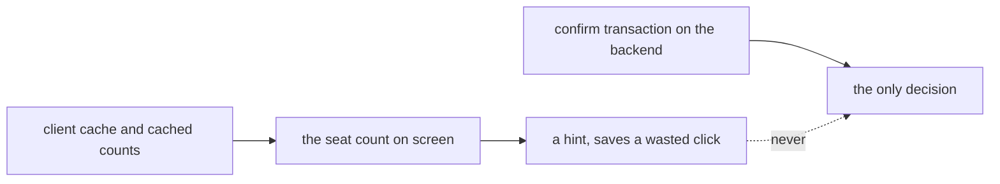
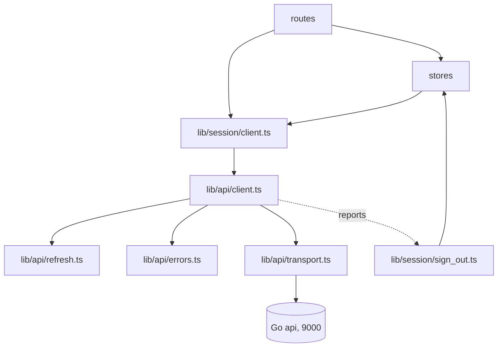
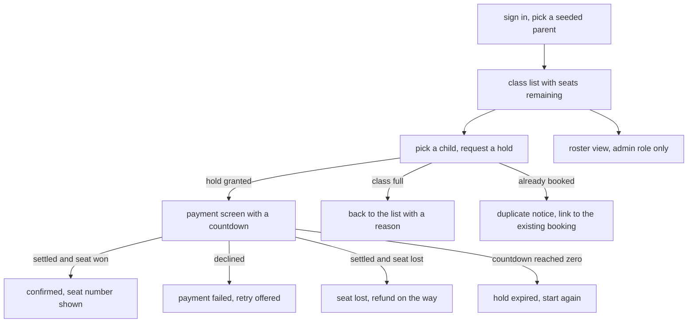
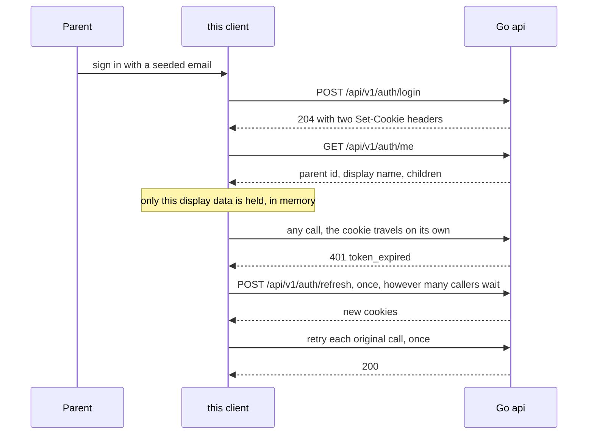

# Frontend High Level Design

What the pieces are, where the boundaries fall, and what a screen is allowed to
assume. Component and type detail is in `LLD.md`, reasoning is in `ADR.md`.

 

## The Rule Everything Else Follows

A seat count is a hint. Every step handles a rejection that contradicts what the
screen showed one second ago, because that is not an edge case, it is the normal
outcome of two parents acting at once.

 

## Layers

| layer | owns | never does |
| :- | :- | :- |
| routes | what a parent sees and clicks | call fetch, decide what a failure means |
| stores | what is currently known | talk to the network |
| `session/client.ts` | wiring the real transport to the real sign out | anything else, it is nine lines |
| `api/client.ts` | every call, the refresh, the one retry, mapping failures | routing, storage, rendering |
| `api/transport.ts` | the only call to fetch in the codebase | interpret a status |
| `session/sign_out.ts` | what ending a session does | decide when it should happen |

The separation between the last two is the one worth defending. The api client
is the only place a 401 can be noticed, and the worst place to know about
routing. So it reports, and something else acts. See ADR-F006.

 

## Routes

| route | purpose | state |
| :- | :- | :- |
| `/sign-in` | mock sign in, seeded email, no password | built |
| `/` | class list with subject, start time, and seats remaining | phase 4 |
| `/book/[classId]` | pick a child, submit, receive a hold | phase 4 |
| `/pay/[bookingId]` | mock payment, hold countdown, honeypot, captcha | phase 5 |
| `/booking/[bookingId]` | booking status in every terminal state | phase 5 |
| `/roster/[classId]` | roster for an admin, hidden from a parent role | phase 7 |
| `/status` | build identity and backend readiness | phase 7 |

Every route is client rendered. Caddy hands the same document to any unknown
path and the router takes it from there, which is why a reload on
`/book/[classId]` works.

 

## Screen Flow

Four of those outcomes are failures, and three of them contradict what the
previous screen showed. That is the shape of this application.

 

## Stores

| store | holds | notes | state |
| :- | :- | :- | :- |
| `auth.ts` | display name, parent id, children, role | memory only, cleared on a hard sign out | built |
| `classes.ts` | the class list and its tags | read through the cache, never trusted for a decision | phase 4 |
| `booking.ts` | the booking in flight, its status, its deadline | drives the countdown | phase 5 |
| `status.ts` | backend version and readiness | populated only while `/status` is open | phase 7 |

 

## Authentication From This Side

| rule | detail |
| :- | :- |
| credentials | every request sends `credentials: "include"`, and nothing else is needed |
| what is held | display name, parent id, children, role. Never a token, never an email |
| where | memory. Not mirrored into storage |
| silent refresh | one refresh, then one retry of the original call. Never a loop |
| single flight | five parallel expiries cause exactly one refresh, and all five retry after it |
| hard sign out | `token_invalid`, `token_reused`, or a failed refresh clears the store, clears storage, and routes to sign in |
| cross-site request forgery | the api checks Origin on mutations, so this client sends from its real origin and never proxies through another host |

That last line is why the two compose files share no network.

 

## What A Screen May Assume

| may assume | may not assume |
| :- | :- |
| the api is the only source of truth | that a seat count it rendered is still true |
| a failure arrives as a typed error it can switch on | that a failure has a message worth showing verbatim |
| the auth store holds display data or nothing | that being signed in means the next call will succeed |
| a 304 is a success | that an unknown error code will never arrive |

 

## Sensitive Data

| surface | rule |
| :- | :- |
| tokens | unreadable by construction. No code path attempts to read, decode, or store one |
| auth store | display name, parent id, children. No email, no token, memory only |
| storage | the cache holds class lists and their tags. Counts, never who booked |
| error text | rendered from the typed code. Server prose is never pasted into the page |
| urls | ids only. No email and no name, ever, in a path or a query |
| telemetry | route names and typed codes only. No identifiers, no free text |
| console | no logging in a production build, so nothing leaks into a screen recording |
| version footer | version and commit only |

 

## Testing

Four tiers, every one against an injected fake transport. No network, no
browser, no containers.

| tier | example |
| :- | :- |
| unit | error mapping, the refresh coordinator, cache freshness |
| edge | an unknown error code, a deadline exactly at zero, a failed refresh |
| integration | the client, the store, and the fake wired together |
| behaviour | the numbered simulations, one file each |

The fake records every call, which is how a test asserts that nothing was sent
at all.

There is no equivalent of the backend's real-database proof, and there should
not be. Nothing in this stack owns an invariant, so nothing here needs a real
dependency to be believed.
