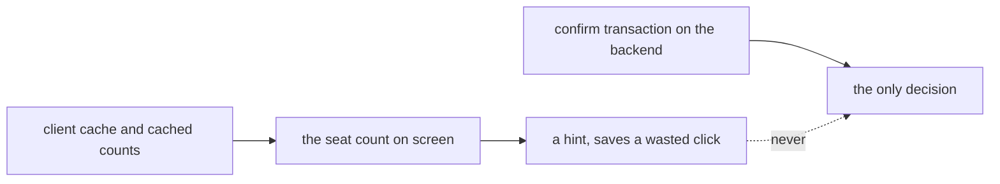
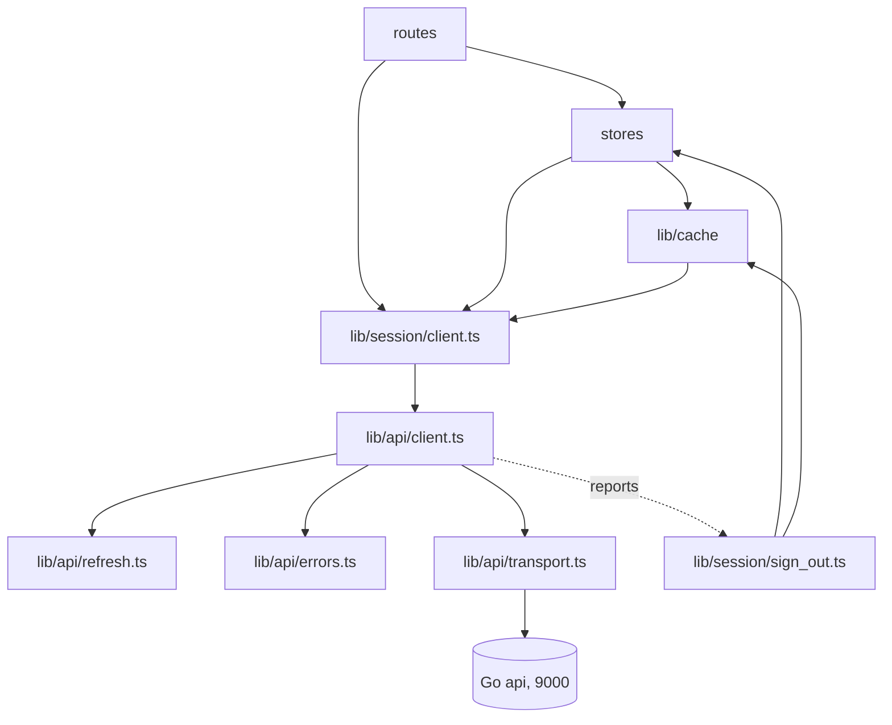
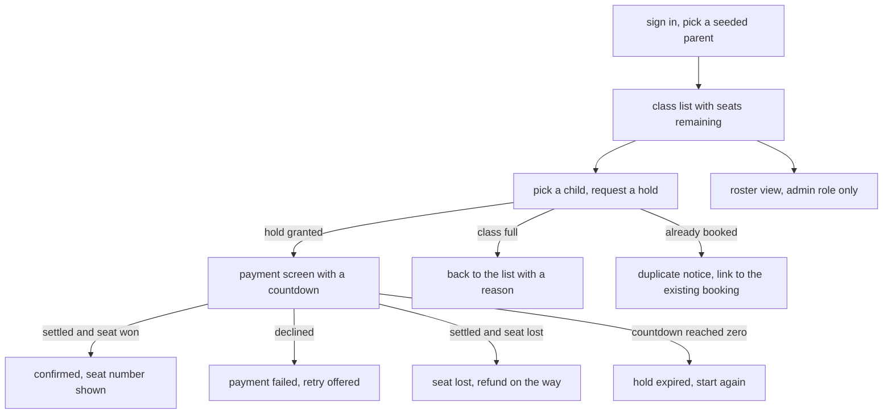
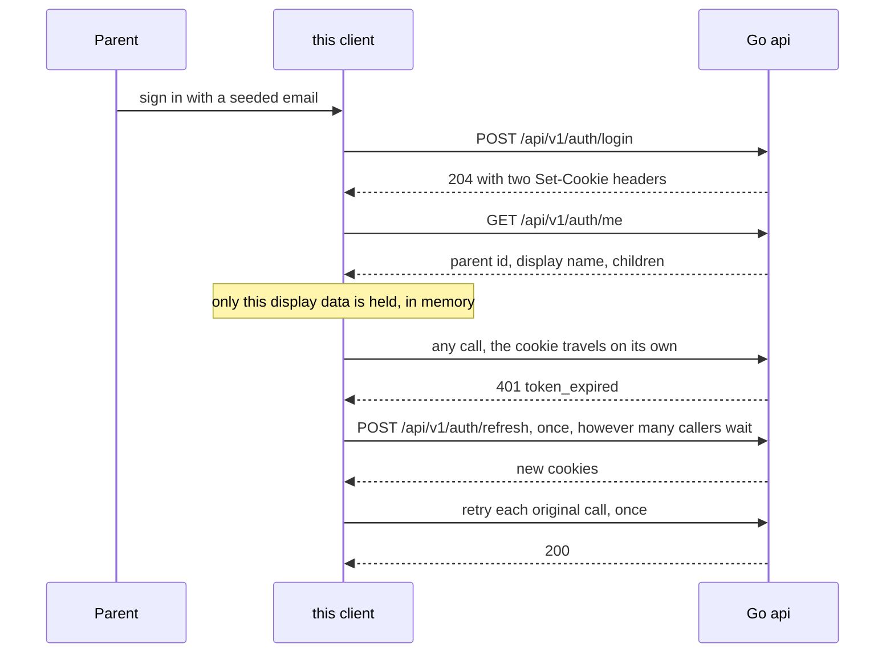
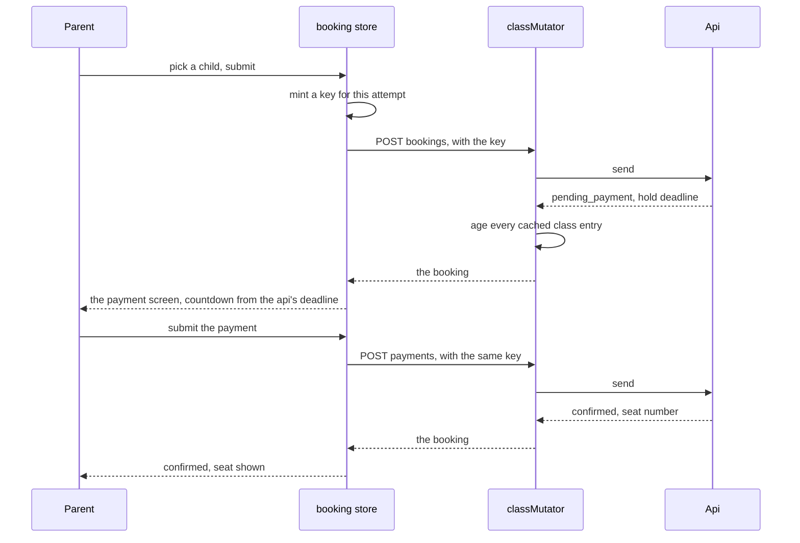

# Frontend High Level Design

What the pieces are, where the boundaries fall, and what a screen is allowed to
assume. Component and type detail is in `LLD.md`, reasoning is in `ADR.md`.

 

## The Rule Everything Else Follows

A seat count is a hint. Every step handles a rejection that contradicts what the
screen showed one second ago, because that is not an edge case, it is the normal
outcome of two parents acting at once.

 

## Layers

| layer | owns | never does |
| :- | :- | :- |
| routes | what a parent sees and clicks | call fetch, decide what a failure means |
| stores | what is currently known | talk to the network |
| `lib/cache` | what may be reused, for how long, and when it stops being true | decide anything a parent is refused or granted |
| `session/client.ts` | wiring the real transport to the real sign out | anything else, it is nine lines |
| `api/client.ts` | every call, the refresh, the one retry, mapping failures | routing, storage, rendering |
| `api/transport.ts` | the only call to fetch in the codebase | interpret a status |
| `session/sign_out.ts` | what ending a session does | decide when it should happen |

The separation between the last two is the one worth defending. The api client
is the only place a 401 can be noticed, and the worst place to know about
routing. So it reports, and something else acts. See ADR-F006.

 

## Routes

| route | purpose | state |
| :- | :- | :- |
| `/sign-in` | mock sign in, seeded email, no password | built |
| `/` | class list with subject, start time, and seats remaining | built |
| `/book/[classId]` | pick a child, submit, receive a hold | built |
| `/pay/[bookingId]` | mock payment, hold countdown, honeypot, captcha | phase 5 |
| `/booking/[bookingId]` | booking status in every terminal state | phase 5 |
| `/roster/[classId]` | roster for an admin, hidden from a parent role | phase 7 |
| `/status` | build identity and backend readiness | phase 7 |

Every route is client rendered. Caddy hands the same document to any unknown
path and the router takes it from there, which is why a reload on
`/book/[classId]` works.

 

## Screen Flow

Four of those outcomes are failures, and three of them contradict what the
previous screen showed. That is the shape of this application.

 

## Stores

| store | holds | notes | state |
| :- | :- | :- | :- |
| `auth.ts` | display name, parent id, children, role | memory only, cleared on a hard sign out | built |
| `classes.ts` | the class list and its tags | reads through `classReader`, never trusted for a decision | built |
| `booking.ts` | the booking in flight, its status, its deadline, and the key covering the attempt | writes through `classMutator`. Drives the countdown in phase 5 | built |
| `status.ts` | backend version and readiness | populated only while `/status` is open | phase 7 |

 

## The Cache

Three tiers by age: under five seconds is served from memory with no request at
all, five to thirty seconds renders at once and is confirmed behind the parent's
back, and past thirty seconds nothing renders until the api has answered.
Confirmation is a conditional request, so the usual answer is a 304 and no body
at all.

Only the class list and a single class are held, because they are the only
things here that are advisory. A booking status, a payment, and a roster each
either decide something or belong to one parent, and a stale copy of any of them
is a wrong answer rather than a slow one.

| event | the cache |
| :- | :- |
| a successful booking, payment, or cancellation | every entry goes cold, so the next view asks the api |
| a failed one | untouched, because nothing is known to have changed |
| a hard sign out | emptied outright, in memory and in session storage |

Detail, including why an invalidation ages an entry rather than deleting it, is
in `LLD.md` and ADR-F016.

 

## Authentication From This Side

| rule | detail |
| :- | :- |
| credentials | every request sends `credentials: "include"`, and nothing else is needed |
| what is held | display name, parent id, children, role. Never a token, never an email |
| where | memory. Not mirrored into storage |
| silent refresh | one refresh, then one retry of the original call. Never a loop |
| single flight | five parallel expiries cause exactly one refresh, and all five retry after it |
| hard sign out | `token_invalid`, `token_reused`, or a failed refresh clears the store, clears storage, and routes to sign in |
| cross-site request forgery | the api checks Origin on mutations, so this client sends from its real origin and never proxies through another host |

That last line is why the two compose files share no network.

 

## The Booking Attempt

One attempt by a parent is two calls, and they are held together by one
idempotency key.

The key is minted once and reused, so a retry of either call produces the first
answer rather than a second charge. A new attempt mints a new key, which is what
a decline needs and what an unresolved attempt must not do. See ADR-F017 and
ADR-F014.

Three of the four things that can go wrong are answered on this path rather than
left to a screen:

| refusal | what the client does |
| :- | :- |
| `class_full` | ages the cached list, so the next view asks the api rather than showing the seat again |
| `already_booked` | shows the notice with a link to the booking the child already has |
| `seat_lost` | ages the cached list for the same reason as `class_full` |

Everything else leaves the cache alone, because a failure that says nothing
about seats must not claim knowledge this client does not have. See ADR-F018.

The payment call is here rather than on the payment screen because the key
belongs to the attempt, and the attempt is what this store holds. Phase 5 builds
the screen on top of behaviour that is already proven.

 

## What A Screen May Assume

| may assume | may not assume |
| :- | :- |
| the api is the only source of truth | that a seat count it rendered is still true |
| a failure arrives as a typed error it can switch on | that a failure has a message worth showing verbatim |
| the auth store holds display data or nothing | that being signed in means the next call will succeed |
| a 304 is a success | that an unknown error code will never arrive |

 

## Sensitive Data

| surface | rule |
| :- | :- |
| tokens | unreadable by construction. No code path attempts to read, decode, or store one |
| auth store | display name, parent id, children. No email, no token, memory only |
| storage | the cache holds class lists and their tags. Counts, never who booked |
| error text | rendered from the typed code. Server prose is never pasted into the page |
| urls | ids only. No email and no name, ever, in a path or a query |
| telemetry | route names and typed codes only. No identifiers, no free text |
| console | no logging in a production build, so nothing leaks into a screen recording |
| version footer | version and commit only |

 

## Testing

Four tiers, every one against an injected fake transport. No network, no
browser, no containers.

| tier | example |
| :- | :- |
| unit | error mapping, the refresh coordinator, cache freshness |
| edge | an unknown error code, a deadline exactly at zero, a failed refresh |
| integration | the client, the store, and the fake wired together |
| behaviour | the numbered simulations, one file each |

The fake records every call, which is how a test asserts that nothing was sent
at all.

There is no equivalent of the backend's real-database proof, and there should
not be. Nothing in this stack owns an invariant, so nothing here needs a real
dependency to be believed.
