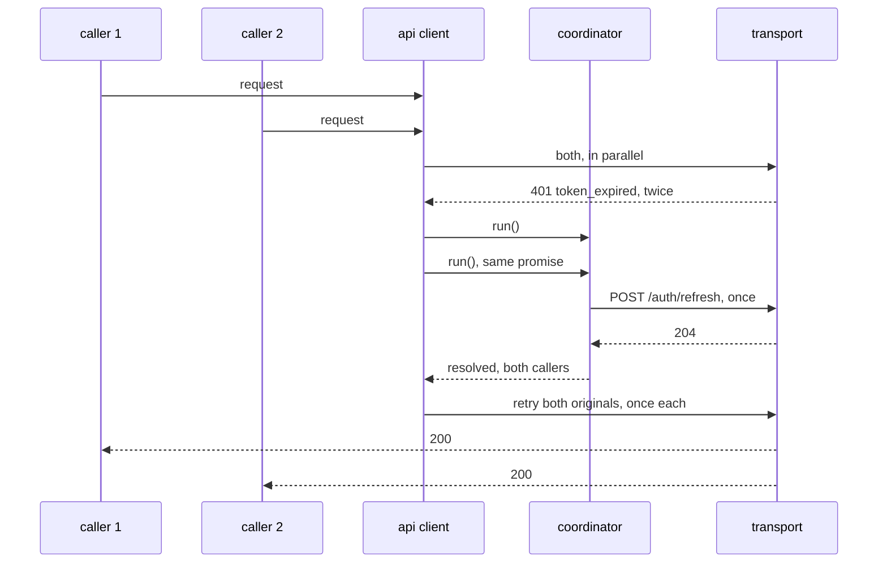
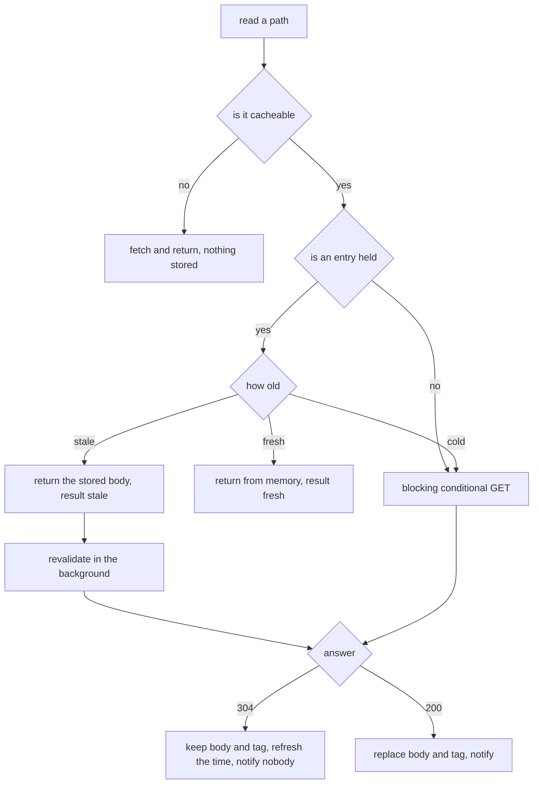

# Frontend Low Level Design

The contracts. Types, the transport, the error table, the refresh flow, and the
store shapes. Boundaries are in `HLD.md`, reasoning is in `ADR.md`.

<br>

## The Api Layer

```
src/lib/api
|
|___types.ts                (wire shapes, the api's own field names)
|___transport.ts            (the interface, and the only call to fetch)
|___transport_fake.ts       (the fake every test uses)
|___errors.ts               (code to kind, and this client's own wording)
|___refresh.ts              (one refresh at a time)
|___client.ts               (the single owner of every call)
```

Nothing outside `transport.ts` calls fetch. Nothing outside `errors.ts` decides
what a failure means.

<br>

## Transport

```ts
interface TransportRequest {
    method: string;
    path: string;
    body?: unknown;
    headers?: Readonly<Record<string, string>>;
}

interface TransportResponse {
    status: number;
    body: unknown;
    headers: Readonly<Record<string, string>>;
}

interface Transport {
    send(request: TransportRequest): Promise<TransportResponse>;
}
```

`createFetchTransport(baseUrl, send?)` is the real one. Four things it does that
are worth stating:

| behaviour | why |
| :- | :- |
| `credentials: "include"` on every request | the whole of this client's token handling |
| response header names lowercased | the conditional request handling reads a tag by name, so the server's casing must not matter |
| 204 and 304 read as no body | a 304 has nothing to parse by definition |
| a non-json or malformed body becomes `undefined` | a proxy returning html must not turn into an exception the caller has to guess about |

The `send` parameter exists so a test can watch what was sent. Production leaves
it out.

`createFakeTransport(handler)` records every call **before** the handler runs.
That ordering is what lets a test see a second refresh attempt while the first
is still in flight, which is the whole point of the single-flight test.

<br>

## Wire Types

The api's own field names, unchanged. See ADR-F009.

```ts
type ParentRole = "parent" | "admin";

interface Child {
    id: string;
    full_name: string;
    grade_level: number;
}

interface Session {
    parent_id: string;
    display_name: string;
    role: ParentRole;
    children: Child[];
}

interface TrialClass {
    id: string;
    subject: string;
    title: string;
    starts_at: string;
    duration_minutes: number;
    capacity: number;
    seats_remaining: number;
}

interface ClassList {
    classes: TrialClass[];
}

type BookingStatus =
    | "pending_payment"
    | "confirmed"
    | "payment_failed"
    | "refund_required"
    | "expired"
    | "cancelled";

interface Booking {
    id: string;
    student_id: string;
    class_id: string;
    status: BookingStatus;
    seat_no: number | null;
    hold_expires_at: string | null;
}

interface ErrorEnvelope {
    error: {
        code: string;
        message: string;
        retry_after_seconds?: number;
        request_id?: string;
        booking_id?: string;
    };
}
```

`seat_no` and `hold_expires_at` are null rather than absent when they do not
apply: a booking with no seat has no seat number, and one that is not holding
has no deadline.

`booking_id` on the envelope is carried by `already_booked` alone. It is what
turns "this child already has a booking" into a link to that booking, which is
the difference between a notice and a dead end.

`starts_at` is formatted for display and never parsed for a rule. Nothing in
this client decides anything from a date.

There is no email and no token in any of these. That is the contract, not an
omission: the api never sends one, so this client can never hold one.

`isErrorEnvelope` is a check rather than an assumption, because a failure can
arrive without an envelope from a proxy or from a crash before the handler ran.

<br>

## Error Mapping

Matching the backend envelope one to one.

| status and code | kind | what the parent sees |
| :- | :- | :- |
| 401 `token_expired` | handled internally | nothing, the refresh and retry are invisible |
| 401 `token_invalid` | `SignedOut` | back to sign in, nothing lost |
| 401 `token_reused` | `SignedOut` | back to sign in with a security notice |
| 403 `not_your_child` | `NotYourChild` | a generic refusal, no detail leaked |
| 403 `forbidden_role` | `Forbidden` | the route is not shown to this role in the first place |
| 409 `already_booked` | `AlreadyBooked` | a link to the existing booking |
| 409 `too_many_holds` | `TooManyHolds` | finish or cancel an existing booking first |
| 409 `class_full` | `ClassFull` | back to the list, count refreshed |
| 409 `seat_lost` | `SeatLost` | the seat is gone, a refund is on the way, nothing further to do |
| 429 `rate_limited` | `RateLimited` | a wait notice with the retry-after seconds |
| 402 `payment_declined` | `PaymentDeclined` | a retry offered on the same booking |
| 400 `invalid_request` | `InvalidRequest` | a generic form error |
| 500 `internal_error` | `Unavailable` | something broke, the booking is untouched, retry offered |
| 503 `dependency_unavailable` | `Unavailable` | the service is having trouble, try shortly |
| anything else | `Unavailable` | the same, rather than a blank page |

`token_expired` appears as `SignedOut` for the case where it survives a refresh
and a retry. On its first appearance the client handles it and a parent never
learns it happened.

`internal_error` is the only code that says nothing about the booking, so the
wording must not guess. It never claims the seat was lost and never claims the
payment failed, because neither is known from here. A test asserts that on the
string itself.

`ApiError` carries `kind`, `code`, `status`, `retryAfterSeconds`, and
`requestId`. Its `message` is this client's wording, never the server's.

<br>

## The Refresh Flow



`createRefreshCoordinator({ refresh, onFailure })`:

| property | detail |
| :- | :- |
| single flight | while one refresh is in flight, `run()` returns the same promise |
| cleared on settle | a later expiry starts a fresh attempt rather than reusing a stale rejection |
| `onFailure` once | called once per failed refresh, never once per waiting caller |
| rejects every waiter | so each caller learns its own request failed |

Why this matters beyond tidiness: the backend rotates the refresh token on use
and treats a second use of a rotated one as reuse, which revokes the whole
family. Five parallel refreshes would end the session they were trying to save.

<br>

## The Request Pipeline

`client.ts`, in order:

```
send once
  under 400                -> success, the whole response
  400 and above            -> map to an ApiError, then:

    code is token_expired  -> coordinator.run(), then send once more
                                success        -> done
                                failure        -> report if SignedOut, throw
    kind is SignedOut      -> report, throw
    anything else          -> throw
```

A 304 is under 400, so it is a success carrying no body rather than a failure.
Two callers read that same pipeline differently:

| entry point | gives back | for |
| :- | :- | :- |
| `request<T>(outgoing)` | the body alone | every call that asked no conditional question |
| `conditionalGet<T>(path, etag)` | `{ notModified, body, etag }` | the cache, which has to tell a 304 from a 200 |

`conditionalGet` sends the stored tag as `if-none-match`, verbatim. An empty tag
sends no header at all, because an empty `If-None-Match` is a different question.
The response tag is read from `etag`, which the transport has already lowercased.

Three rules fall out of that shape:

| rule | why |
| :- | :- |
| the refresh call itself does not go through this path | otherwise a failed refresh would report the sign out twice, once from the coordinator and once from the pipeline |
| `login` does not go through this path | a wrong email cannot be fixed by refreshing anything |
| there is no second retry | if the call is still unauthorised after the refresh, the session is over. The `allowRefresh` flag is not a counter, it is a single chance by construction |

<br>

## The Internal Cache

```
src/lib/cache
|
|___policy.ts               (fresh, stale, cold, from an age and nothing else)
|___key.ts                  (what may be held, and under what key)
|___session_mirror.ts       (the copy that survives a reload, and never throws)
|___store.ts                (the entries, and who is told when one changes)
|___read_through.ts         (the read path, and the conditional request)
|___mutation.ts             (the write path, and the invalidation it owns)
```

Six files rather than the two the plan named. `policy.ts` decides nothing about
storage, `session_mirror.ts` knows nothing about entries, and the read and write
paths are separate because they are separate rules: one asks the api whether a
copy still stands, the other tells the cache that a copy is finished with.

### Tiers

| tier | age | behaviour | cost |
| :- | :- | :- | :- |
| fresh | under 5s | returned from memory | nothing, no request is sent |
| stale | 5s to 30s | returned at once, revalidated behind it | one conditional request |
| cold | 30s and over, or invalidated | nothing renders until the api answers | one conditional request |

Both boundaries are exclusive at the low end. Exactly 5 seconds is stale and
exactly 30 is cold, so an entry sitting on a line costs a conditional request
rather than a wrong answer. A negative age means the system clock moved
backwards, which makes the timestamp meaningless, so it reads as cold.

### The entry

```ts
interface CacheEntry {
    body: unknown;
    etag: string;
    storedAt: number;
}
```

The tag is stored verbatim and sent back verbatim. This client never parses one,
compares two, or reasons about what is inside. Only the api knows what its own
tags mean, which is why a weak validator needs no special case here.

### The read path



Every read reports which of those it was.

| result | means |
| :- | :- |
| `fresh` | served from memory, nothing sent |
| `stale` | the stored body was returned and a revalidation is running |
| `revalidated` | the api answered 304 and the stored body still stands |
| `miss` | the api answered with a body, which is now the stored one |

Phase 7 turns that value into `frontend_cache_lookup_total{result}`. It is a
plain return value for now, so nothing in the cache has to know a telemetry
emitter exists.

Four properties are worth stating, because each one is a thing that goes wrong
in a cache that was not written carefully:

| property | detail |
| :- | :- |
| a 304 never notifies | the body did not change, so repainting the screen would be work for nothing |
| a background failure is swallowed | the parent already has a list on screen, and a stale list is not worth an error banner. A 401 still ends the session, because that happens inside the api client |
| two stale reads share one revalidation | for the same reason the refresh is single flight: the second request buys nothing |
| a non-cacheable path passes straight through | so routing a roster through the reader cannot turn it into an entry |

### What is held

| held | never held |
| :- | :- |
| the class list, `/api/v1/classes` | booking status, payment, roster, auth, admin |
| a single class, `/api/v1/classes/{id}` | anything nested under a class, the roster included |

The key is the path with its query string attached, verbatim, so a filtered list
can never be served for an unfiltered one. Two orderings of the same parameters
are two entries, which costs one conditional request and never a wrong answer.

### Invalidation

| event | what happens | why |
| :- | :- | :- |
| a successful mutation | every entry goes cold, tags kept | nothing renders from a cold entry, and the tag makes the next read a 304 rather than a full body. See ADR-F016 |
| a failed mutation | nothing | a rejection is not a change, and a 500 says nothing at all about what happened |
| a hard sign out | every entry deleted, memory and storage alike | nothing may survive into another parent's session on a shared machine |

Mutations go through `createCacheAwareMutator`, so the invalidation is part of
the call rather than a line each caller has to remember. The drop happens before
the caller's promise resolves, so a screen that returns to the list on success
can never be served the count it just changed.

The plan also names a tab that has been hidden for more than thirty seconds. It
needs no code: the tier is decided from the entry's age at the moment it is
read, so a tab that comes back after thirty seconds finds a cold entry by
arithmetic rather than by an event listener.

### Storage

An in-memory map is the real store, mirrored into `sessionStorage` under the
`cache:` prefix. `sessionStorage` and not `localStorage`, so nothing outlives
the browsing session on a shared machine.

The mirror never throws. Quota exhaustion, a disabled storage, and private
browsing all raise from the same calls, and none of them is a reason for a page
to break, so every failure degrades to no mirror at all and the memory map
carries on. An entry that will not parse reads as no entry, which falls through
to the network.

The mirror is read lazily, on the first miss for a key, so nothing is paid for
entries never asked for. Invalidation walks the mirror as well as the map,
because after a reload the map is empty and an entry nobody has read yet is
exactly the one that would still be believed.

### The wiring

```
lib/session/cache.ts        the one store, importing nothing from the api client
lib/session/cached_api.ts   classReader and classMutator, over that store
```

`cache.ts` is deliberately thin and dependency free. The hard sign out has to
empty the store, and the api client has to be able to report a hard sign out, so
anything joining the two would make a cycle out of a wiring file.

`cached_api.ts` has no consumer yet. `lib/stores/classes.ts` in phase 4 is the
first, and it is the seam that keeps a store from reaching past the cache to the
api client directly.

<br>

## Stores

### auth.ts

```ts
type SignOutReason = "requested" | "session_ended" | "token_reused";

interface AuthState {
    session: Session | null;
    signedOutReason: SignOutReason | null;
}
```

| method | does |
| :- | :- |
| `signIn(session)` | copies across only the fields this client may hold |
| `signOut(reason)` | drops everything and records why |
| `acknowledgeNotice()` | clears the reason once the sign-in screen has shown it |

`signIn` rebuilds the object field by field rather than storing what arrived.
That is the guard, not a formality: if the api ever starts sending an email
alongside the session, it stops there rather than reaching a component. The test
asserts it on the serialized state, because the risk is a field nobody thought
to look for.

### classes.ts

```ts
interface ClassesState {
    classes: TrialClass[];
    loading: boolean;
    failure: string;
    lastResult: CacheLookupResult | null;
}
```

| method | does |
| :- | :- |
| `load()` | reads `/api/v1/classes` through `classReader`, and hands back the background revalidation on a stale read |
| `reset()` | empties the store, which the session watcher does on a sign out |

Every read goes through the reader, never the api client. A store reaching past
it is the one way the internal cache can go wrong, so there is exactly one file
that reads classes and a route test asserts the path it reads.

A failed read leaves the list already on screen. It is no more wrong than it was
a second ago, and blanking the page would take away the one thing the parent
could still act on.

### booking.ts

```ts
interface BookingState {
    booking: Booking | null;
    attemptKey: string;
    submitting: boolean;
    failure: BookingFailure | null;
}
```

| method | does |
| :- | :- |
| `create(request)` | mints a key, POSTs the booking through `classMutator` |
| `pay(bookingId, amount)` | POSTs the payment with the key the attempt already has |
| `load(bookingId)` | GETs the booking straight through the api client, never the cache |
| `dismissFailure()` | clears the message on screen, and touches no key |
| `reset()` | empties the store, key included |

The key is held in the state and in a variable beside it, so `pay` can read the
attempt's key without subscribing to its own store to find out.

`load` is the one method that goes past `classMutator`. A booking status is what
decides, so it is never cached, and routing it through the mutator would age the
class list every time a screen read a status. See ADR-F024.

Two named sets carry every rule this store applies to a refusal.

```ts
const kindsThatMoveASeatCount: ReadonlySet<string> = new Set(["ClassFull", "SeatLost"]);
const kindsThatEndTheAttempt: ReadonlySet<string> = new Set(["PaymentDeclined", "InvalidRequest"]);
```

The first ages the cached class list, because both are the api reporting that a
seat count moved, arriving on the failure path. Every other failure leaves the
cache alone. See ADR-F018.

The second mints a fresh idempotency key. A decline is an answer, so the attempt
is finished and paying again is a new one. An `internal_error` is the opposite:
the outcome is unknown, so the same key has to go back or a retry risks charging
twice. Putting that decision here rather than on the screen is ADR-F021.

A failure never clears the booking. A declined payment leaves the parent holding
a booking they can pay for again, and throwing it away would send them back to
the class list while their hold is still standing.

<br>

## Components

| component | props | notes |
| :- | :- | :- |
| `VersionFooter.svelte` | none | the build identity, on every page |
| `ClassCard.svelte` | `trialClass` | one class, and either a way in or the reason there is none |
| `ChildPicker.svelte` | `childrenOnAccount`, `selected` (bound), `disabled` | radio group, one child preselected when there is only one |
| `HoldCountdown.svelte` | `deadline`, `onExpire`, `now` | ticks once a second, reports zero once |
| `PaymentForm.svelte` | `amountCents`, `currency`, `submitting`, `closed`, `retryOf`, `onSubmit` | no typeable field at all |
| `BookingStatus.svelte` | `booking` | a headline and guidance for every status the enum can hold |

`ChildPicker` names its list `childrenOnAccount` rather than `children`, which
Svelte reserves for the content a parent component passes in. Two meanings
behind one word in a component file is a bug waiting for somebody in a hurry.

`ClassCard` treats any count at or below zero as full, which covers no seats
left, every seat confirmed, and the negative that arrives only if capacity were
lowered under confirmed bookings. A full class shows no link at all rather than
a disabled one. See ADR-F019.

`HoldCountdown` holds a tick counter and nothing else. Every render works the
remainder out from the deadline and the clock, so a suspended tab shows the
right number on its first frame back. `onExpire` fires once rather than on every
tick, because what it does is ask the api a question. See ADR-F022 and ADR-F023.

`PaymentForm` has no input, textarea, or select, and a test asserts that. There
is nothing to type, so there is nothing to leak, and a mock payment screen that
looked like a real one would be worse than one that says what it is.

`BookingStatus` carries a `data-status` attribute, so a screen above it branches
on the enum rather than on wording. Its two tables cover all six statuses: a
missing case would leave a parent staring at their own booking with nothing to
read.

<br>

## The Countdown

`lib/booking/countdown.ts`, one exported function and one shape.

```ts
export function remainingFor(deadline: string | null, now: number): Remaining;

interface Remaining {
    milliseconds: number;   // never negative
    expired: boolean;
    label: string;          // mm:ss, "00:00" once expired
}
```

Three inputs read as expired rather than as an error: `null`, which is what the
api sends for a booking that is not holding, an unparseable string, and a
deadline already past. The boundary is inclusive, matching the backend, where a
hold ending on this instant is one the worker may already have swept.

The seconds round up, so 400 milliseconds left reads as `00:01`. Rounding down
would show `00:00` beside a control that still works.

It is a function of its two arguments and holds nothing, which is why the past
deadline, the unparseable one, and the tab that was suspended are all asserted
as single values instead of through a rendered component.

<br>

## Idempotency

`lib/api/idempotency.ts`, one exported function and one header name.

```ts
export const idempotencyKeyHeader = "idempotency-key";
export function newIdempotencyKey(): string;
```

`crypto.randomUUID` where it exists, and sixteen random bytes as hex where it
does not. Never a timestamp and never a counter: both are unique and both are
guessable, and the backend honours a matching key as a promise that two calls
are the same call. See ADR-F017.

<br>

## The Session Wiring

```
lib/session/sign_out.ts     auth.signOut(reason), sessionStorage.clear(), goto("/sign-in")
lib/session/client.ts       createApiClient({ transport: fetch transport, onSignOut: hardSignOut })
```

`reasonForCode` maps `token_reused` to its own reason and everything else to a
plain ending. A reused refresh token is either a stale tab or somebody else
holding a copy, and the parent is told rather than quietly returned to the form.

`sessionStorage` is cleared wholesale. See ADR-F007.

The sign out is fired and not awaited. The call that failed is already on its
way back to its caller with the reason, and the navigation must not be something
that caller waits for.

<br>

## Build Time Constants

`vite.config.ts` injects three values through `define`, and
`src/lib/config/environment.ts` is the only file that reads them.

| constant | from | default |
| :- | :- | :- |
| `__API_BASE_URL__` | `API_BASE_URL` | http://127.0.0.1:9000 |
| `__BUILD_VERSION__` | `BUILD_VERSION` | dev |
| `__BUILD_COMMIT__` | `BUILD_COMMIT` | unknown |

They are declared to TypeScript in `src/app.d.ts` inside `declare global`, which
is required because that file has an `export` and would otherwise not be global.

The dev server and preview both bind `127.0.0.1` explicitly. The default
resolves `localhost`, which can land on the IPv6 address alone, and a reviewer
following the instructions would then get a refused connection from a server
that says it is running.

<br>

## Tests

| file | tier | covers |
| :- | :- | :- |
| `lib/api/errors.test.ts` | unit, edge | the whole mapping table, an unknown code, a missing envelope, wording that leaks nothing |
| `lib/api/transport.test.ts` | unit, edge | credentials, url building, headers, 204, non-json bodies |
| `lib/api/refresh.test.ts` | unit, edge | single flight, one report per failure, a cleared in-flight promise |
| `lib/api/client.test.ts` | unit, edge, integration | the pipeline, one retry, no loop, login not refreshing, the conditional request |
| `lib/cache/policy.test.ts` | unit, edge | the three tiers, both boundaries, an entry from the future |
| `lib/cache/key.test.ts` | unit, edge | what may be held, and two query strings never colliding |
| `lib/cache/session_mirror.test.ts` | unit, edge | a round trip, the namespace, a storage that throws, an entry that will not parse |
| `lib/cache/store.test.ts` | unit, edge, integration | save, touch, invalidate, clear, who is notified, surviving a reload |
| `lib/cache/read_through.test.ts` | unit, edge, integration | all four results, a swallowed background failure, a shared revalidation |
| `lib/cache/mutation.test.ts` | integration, edge | a success invalidates, a failure does not |
| `lib/api/idempotency.test.ts` | unit, edge | uniqueness, length, and the fallback still being random |
| `lib/stores/auth.test.ts` | unit, edge | what is held, and what is dropped |
| `lib/stores/classes.test.ts` | unit, edge, integration | the path read, the tier reported, a failure leaving the list alone |
| `lib/stores/booking.test.ts` | unit, edge, integration | one key across both calls, a fresh key per attempt, a duplicate carrying its booking |
| `lib/components/ClassCard.test.ts` | unit, edge | zero seats, capacity taken, a negative, and one seat left |
| `lib/components/ChildPicker.test.ts` | unit, edge | every child offered, one preselected, none on an empty account |
| `lib/session/sign_out.test.ts` | unit, integration | store cleared, cache cleared, storage cleared, stores reset, navigation requested |
| `routes/sign-in/page.test.ts` | integration, behaviour | the screen, including the notice after a reused token |
| `routes/page.test.ts` | integration, edge | the list renders, a full class offers no way in, a failed read says so |
| `routes/book/[classId]/page.test.ts` | integration, edge | a hold moves on, a full class and a duplicate are answered on the screen |
| `tests/simulation_f09_silent_refresh.test.ts` | behaviour | three parallel expiries, one refresh, three retries |
| `tests/simulation_f10_hard_sign_out.test.ts` | behaviour | a reused token ends the session once, with no retry loop |
| `tests/simulation_f12_fresh_cache.test.ts` | behaviour | a second view inside five seconds sends nothing at all |
| `tests/simulation_f13_stale_revalidation.test.ts` | behaviour | the stale body renders first, the 304 changes nothing but the age |
| `tests/simulation_f14_mutation_invalidates.test.ts` | behaviour | the new seat count renders, not the one that was just changed |
| `tests/simulation_f01_happy_path_booking.test.ts` | behaviour | pick, hold, pay, seat number. One key on both calls |
| `tests/simulation_f02_stale_seat_count.test.ts` | behaviour | a full class refuses, the entry is aged, the next read shows the real count |
| `tests/simulation_f04_duplicate_booking.test.ts` | behaviour | one call, no retry, and a link to the booking that exists |

The error mapping table is written out by hand in its test rather than read from
the implementation. A test that asks the mapping what it maps and then agrees
with the answer proves nothing.

Behaviour simulations live in `src/tests/`, one file per simulation, named after
it. Everything else sits beside the code it covers.
