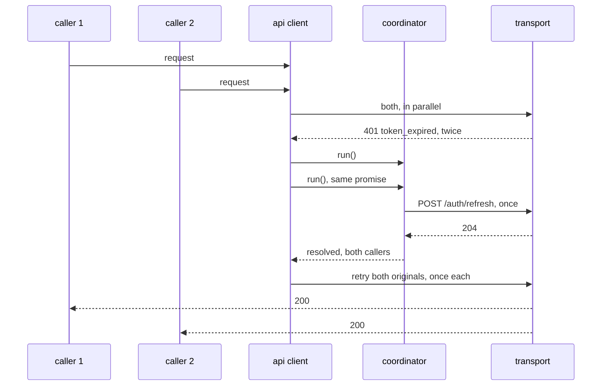

# Frontend Low Level Design

The contracts. Types, the transport, the error table, the refresh flow, and the
store shapes. Boundaries are in `HLD.md`, reasoning is in `ADR.md`.

<br>

## The Api Layer

```
src/lib/api
|
|___types.ts                (wire shapes, the api's own field names)
|___transport.ts            (the interface, and the only call to fetch)
|___transport_fake.ts       (the fake every test uses)
|___errors.ts               (code to kind, and this client's own wording)
|___refresh.ts              (one refresh at a time)
|___client.ts               (the single owner of every call)
```

Nothing outside `transport.ts` calls fetch. Nothing outside `errors.ts` decides
what a failure means.

<br>

## Transport

```ts
interface TransportRequest {
    method: string;
    path: string;
    body?: unknown;
    headers?: Readonly<Record<string, string>>;
}

interface TransportResponse {
    status: number;
    body: unknown;
    headers: Readonly<Record<string, string>>;
}

interface Transport {
    send(request: TransportRequest): Promise<TransportResponse>;
}
```

`createFetchTransport(baseUrl, send?)` is the real one. Four things it does that
are worth stating:

| behaviour | why |
| :- | :- |
| `credentials: "include"` on every request | the whole of this client's token handling |
| response header names lowercased | the conditional request handling reads a tag by name, so the server's casing must not matter |
| 204 and 304 read as no body | a 304 has nothing to parse by definition |
| a non-json or malformed body becomes `undefined` | a proxy returning html must not turn into an exception the caller has to guess about |

The `send` parameter exists so a test can watch what was sent. Production leaves
it out.

`createFakeTransport(handler)` records every call **before** the handler runs.
That ordering is what lets a test see a second refresh attempt while the first
is still in flight, which is the whole point of the single-flight test.

<br>

## Wire Types

The api's own field names, unchanged. See ADR-F009.

```ts
type ParentRole = "parent" | "admin";

interface Child {
    id: string;
    full_name: string;
    grade_level: number;
}

interface Session {
    parent_id: string;
    display_name: string;
    role: ParentRole;
    children: Child[];
}

interface ErrorEnvelope {
    error: {
        code: string;
        message: string;
        retry_after_seconds?: number;
        request_id?: string;
    };
}
```

There is no email and no token in any of these. That is the contract, not an
omission: the api never sends one, so this client can never hold one.

`isErrorEnvelope` is a check rather than an assumption, because a failure can
arrive without an envelope from a proxy or from a crash before the handler ran.

<br>

## Error Mapping

Matching the backend envelope one to one.

| status and code | kind | what the parent sees |
| :- | :- | :- |
| 401 `token_expired` | handled internally | nothing, the refresh and retry are invisible |
| 401 `token_invalid` | `SignedOut` | back to sign in, nothing lost |
| 401 `token_reused` | `SignedOut` | back to sign in with a security notice |
| 403 `not_your_child` | `NotYourChild` | a generic refusal, no detail leaked |
| 403 `forbidden_role` | `Forbidden` | the route is not shown to this role in the first place |
| 409 `already_booked` | `AlreadyBooked` | a link to the existing booking |
| 409 `too_many_holds` | `TooManyHolds` | finish or cancel an existing booking first |
| 409 `class_full` | `ClassFull` | back to the list, count refreshed |
| 409 `seat_lost` | `SeatLost` | the seat is gone, a refund is on the way, nothing further to do |
| 429 `rate_limited` | `RateLimited` | a wait notice with the retry-after seconds |
| 402 `payment_declined` | `PaymentDeclined` | a retry offered on the same booking |
| 400 `invalid_request` | `InvalidRequest` | a generic form error |
| 500 `internal_error` | `Unavailable` | something broke, the booking is untouched, retry offered |
| 503 `dependency_unavailable` | `Unavailable` | the service is having trouble, try shortly |
| anything else | `Unavailable` | the same, rather than a blank page |

`token_expired` appears as `SignedOut` for the case where it survives a refresh
and a retry. On its first appearance the client handles it and a parent never
learns it happened.

`internal_error` is the only code that says nothing about the booking, so the
wording must not guess. It never claims the seat was lost and never claims the
payment failed, because neither is known from here. A test asserts that on the
string itself.

`ApiError` carries `kind`, `code`, `status`, `retryAfterSeconds`, and
`requestId`. Its `message` is this client's wording, never the server's.

<br>

## The Refresh Flow



`createRefreshCoordinator({ refresh, onFailure })`:

| property | detail |
| :- | :- |
| single flight | while one refresh is in flight, `run()` returns the same promise |
| cleared on settle | a later expiry starts a fresh attempt rather than reusing a stale rejection |
| `onFailure` once | called once per failed refresh, never once per waiting caller |
| rejects every waiter | so each caller learns its own request failed |

Why this matters beyond tidiness: the backend rotates the refresh token on use
and treats a second use of a rotated one as reuse, which revokes the whole
family. Five parallel refreshes would end the session they were trying to save.

<br>

## The Request Pipeline

`client.ts`, in order:

```
send once
  304                      -> success with no body
  under 400                -> success with the body
  400 and above            -> map to an ApiError, then:

    code is token_expired  -> coordinator.run(), then send once more
                                success        -> done
                                failure        -> report if SignedOut, throw
    kind is SignedOut      -> report, throw
    anything else          -> throw
```

Three rules fall out of that shape:

| rule | why |
| :- | :- |
| the refresh call itself does not go through this path | otherwise a failed refresh would report the sign out twice, once from the coordinator and once from the pipeline |
| `login` does not go through this path | a wrong email cannot be fixed by refreshing anything |
| there is no second retry | if the call is still unauthorised after the refresh, the session is over. The `allowRefresh` flag is not a counter, it is a single chance by construction |

<br>

## Stores

### auth.ts

```ts
type SignOutReason = "requested" | "session_ended" | "token_reused";

interface AuthState {
    session: Session | null;
    signedOutReason: SignOutReason | null;
}
```

| method | does |
| :- | :- |
| `signIn(session)` | copies across only the fields this client may hold |
| `signOut(reason)` | drops everything and records why |
| `acknowledgeNotice()` | clears the reason once the sign-in screen has shown it |

`signIn` rebuilds the object field by field rather than storing what arrived.
That is the guard, not a formality: if the api ever starts sending an email
alongside the session, it stops there rather than reaching a component. The test
asserts it on the serialized state, because the risk is a field nobody thought
to look for.

<br>

## The Session Wiring

```
lib/session/sign_out.ts     auth.signOut(reason), sessionStorage.clear(), goto("/sign-in")
lib/session/client.ts       createApiClient({ transport: fetch transport, onSignOut: hardSignOut })
```

`reasonForCode` maps `token_reused` to its own reason and everything else to a
plain ending. A reused refresh token is either a stale tab or somebody else
holding a copy, and the parent is told rather than quietly returned to the form.

`sessionStorage` is cleared wholesale. See ADR-F007.

The sign out is fired and not awaited. The call that failed is already on its
way back to its caller with the reason, and the navigation must not be something
that caller waits for.

<br>

## Build Time Constants

`vite.config.ts` injects three values through `define`, and
`src/lib/config/environment.ts` is the only file that reads them.

| constant | from | default |
| :- | :- | :- |
| `__API_BASE_URL__` | `API_BASE_URL` | http://127.0.0.1:9000 |
| `__BUILD_VERSION__` | `BUILD_VERSION` | dev |
| `__BUILD_COMMIT__` | `BUILD_COMMIT` | unknown |

They are declared to TypeScript in `src/app.d.ts` inside `declare global`, which
is required because that file has an `export` and would otherwise not be global.

The dev server and preview both bind `127.0.0.1` explicitly. The default
resolves `localhost`, which can land on the IPv6 address alone, and a reviewer
following the instructions would then get a refused connection from a server
that says it is running.

<br>

## Tests

| file | tier | covers |
| :- | :- | :- |
| `lib/api/errors.test.ts` | unit, edge | the whole mapping table, an unknown code, a missing envelope, wording that leaks nothing |
| `lib/api/transport.test.ts` | unit, edge | credentials, url building, headers, 204, non-json bodies |
| `lib/api/refresh.test.ts` | unit, edge | single flight, one report per failure, a cleared in-flight promise |
| `lib/api/client.test.ts` | unit, edge, integration | the pipeline, one retry, no loop, login not refreshing |
| `lib/stores/auth.test.ts` | unit, edge | what is held, and what is dropped |
| `lib/session/sign_out.test.ts` | unit, integration | store cleared, storage cleared, navigation requested |
| `routes/sign-in/page.test.ts` | integration, behaviour | the screen, including the notice after a reused token |
| `tests/simulation_f09_silent_refresh.test.ts` | behaviour | three parallel expiries, one refresh, three retries |
| `tests/simulation_f10_hard_sign_out.test.ts` | behaviour | a reused token ends the session once, with no retry loop |

The error mapping table is written out by hand in its test rather than read from
the implementation. A test that asks the mapping what it maps and then agrees
with the answer proves nothing.

Behaviour simulations live in `src/tests/`, one file per simulation, named after
it. Everything else sits beside the code it covers.
