# Frontend Test Diagram

Every test in this stack, what it proves, and the command that runs that one
file on its own. `how-to.md` has the whole-suite commands, this file is the
index underneath them.

Run everything from `frontend/` unless a line says otherwise. The backend has
its own copy of this file at `backend/tests-and-diagram.md`.

<br>

## What Runs What

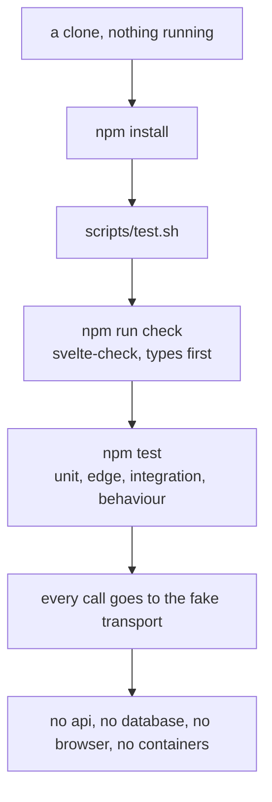

Nothing in this stack needs the backend running. Every test drives a fake
transport, so the whole suite passes on a machine with no Docker and no Go.

Type checking runs first on purpose. A suite that passes while the types are
broken is reporting on a build nobody can ship.

<br>

## The Four Tiers

| tier | what a case in it asks | needs |
| :- | :- | :- |
| unit | one function or one component, one answer | nothing |
| edge | the same thing at its boundaries and its refusals | nothing |
| integration | a store, a client, and a screen wired together | nothing |
| behaviour | a whole scenario as a parent would meet it | nothing |

There is no fifth tier here. The proof tier belongs to the backend, where the
seat is actually decided. What this stack proves is that the client asks
correctly and is honest about every answer it is given.

The tier is written into the case name, so it can be run on its own:

```sh
npm test -- -t "edge:"
```

<br>

## Running One Test

```sh
npm test                                    # every file
npm test -- src/lib/cache                   # one folder
npm test -- src/lib/cache/policy.test.ts    # one file
npm test -- -t "behaviour:"                 # one tier, everywhere
npm test -- --reporter=verbose src/lib/cache/policy.test.ts
```

A path with brackets in it is quoted, because the shell would otherwise read
them:

```sh
npm test -- 'src/routes/book/[classId]/page.test.ts'
```

<br>

## The Tests

Seventeen scenarios, numbered `F1` to `F17` so they never collide with the
backend's own numbers. They live in `src/tests/`, one file each, and they are
the behaviour tier: a whole flow, from what a parent does to what they end up
looking at.

<br>

### F1: the happy path

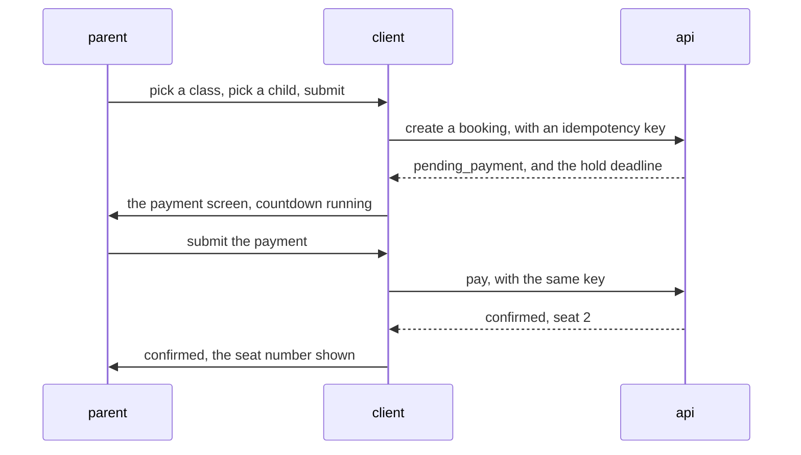

Proves: the countdown runs from the deadline the api returned, both calls carry
the same idempotency key, the confirmed seat number is what the store ends up
holding, and the booking invalidates the class list so the next view of it is
the count after the seat was taken.

```sh
npm test -- src/tests/simulation_f01_happy_path_booking.test.ts
```

<br>

### F2: the class filled while the parent was choosing

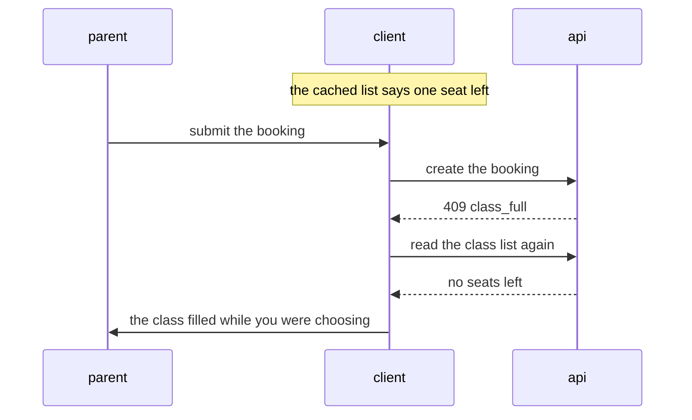

Proves: the client never insists its own count was right. The entry is
invalidated, the list is read again, and the message names the real cause. A
cached count is a hint, the api is the only thing that decides.

```sh
npm test -- src/tests/simulation_f02_stale_seat_count.test.ts
```

<br>

### F3: the payment was declined

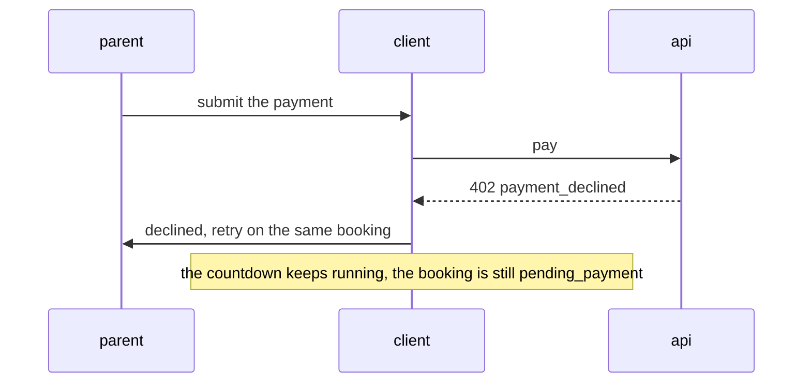

Proves: the booking is not abandoned, the countdown continues, the retry reuses
the booking while minting a fresh idempotency key, and the cached class list is
left alone, because a decline says nothing about seat counts. A decline is a
finished attempt, so sending the same key back would replay the decline for as
long as the parent kept trying.

```sh
npm test -- src/tests/simulation_f03_payment_declined.test.ts
```

<br>

### F4: this child already has a booking

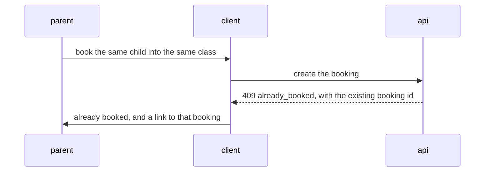

Proves: no second booking is attempted, and the link resolves to the booking
the child already has. Nothing here checks first and then books, because a
check followed by a write is the bug this whole exercise is about.

```sh
npm test -- src/tests/simulation_f04_duplicate_booking.test.ts
```

<br>

### F5: the seat was lost after paying

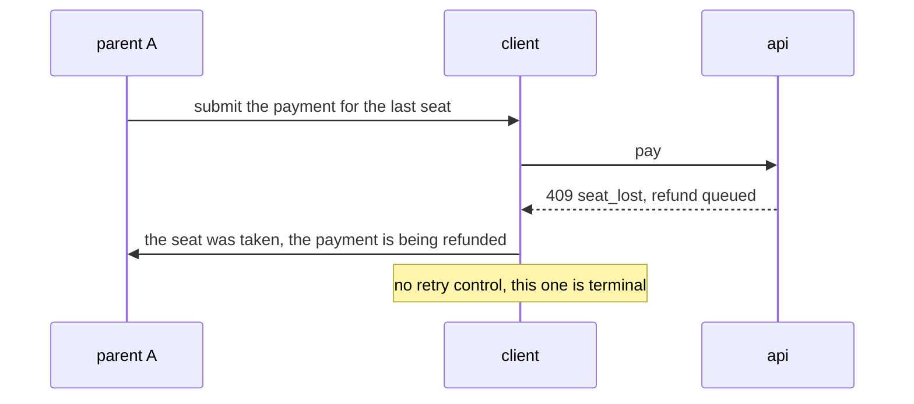

Proves: `SeatLost` renders a terminal message with no retry control, reads
differently from `PaymentDeclined`, and sends the class list to be read again,
because a lost seat is proof the cached count was wrong. Unlike a decline, the
state is carried by the status element rather than by the wording, so no test
and no screen matches on prose. Both are refusals of the same call, and
telling them apart is the difference between a parent who waits for a refund
and a parent who tries to pay again.

```sh
npm test -- src/tests/simulation_f05_seat_lost_after_paying.test.ts
```

<br>

### F6: the hold countdown reaches zero

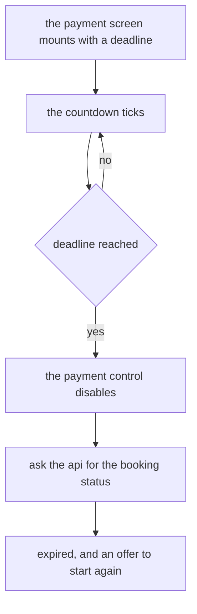

Proves: the control disables at zero without waiting for a round trip, the
screen still confirms the real status with the api, and it asks once rather
than once per tick. A hold that had already ended before the screen opened
closes it at once. Waiting for the api before
disabling would leave a live button on a hold that has gone. Declaring the
booking expired from the browser's clock would be this client deciding
something only the backend decides.

```sh
npm test -- src/tests/simulation_f06_hold_countdown.test.ts
```

<br>

### F7: the honeypot and the fill timer

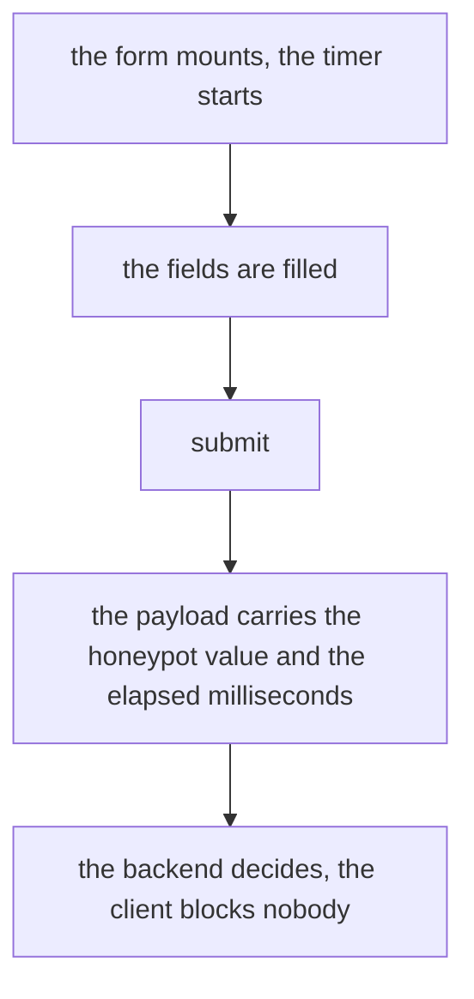

Proves: the honeypot input is present, hidden, empty by default, out of the
accessibility tree and out of the keyboard order, the elapsed time is a real
measurement rather than a constant, and none of the three signals says anything
about the parent. A hard coded number would pass the backend's check while
proving nothing about who filled the form in.

```sh
npm test -- src/tests/simulation_f07_honeypot_and_fill_timer.test.ts
```

<br>

### F8: the submit control is clicked twice

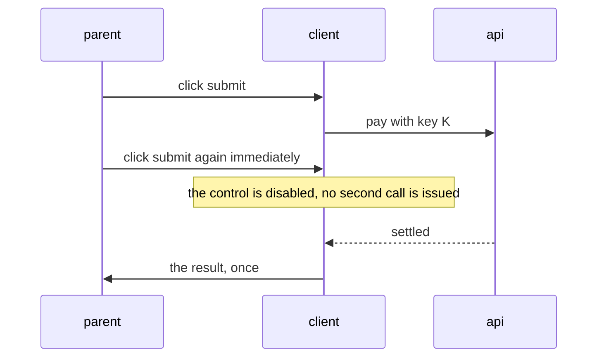

Proves: exactly one call is recorded, the control is disabled for the whole
in-flight window, and the idempotency key would have made a leaked second call
harmless anyway. The control is the cheap layer, the key is the correct one.

```sh
npm test -- src/tests/simulation_f08_double_submit.test.ts
```

<br>

### F9: silent refresh, single flight

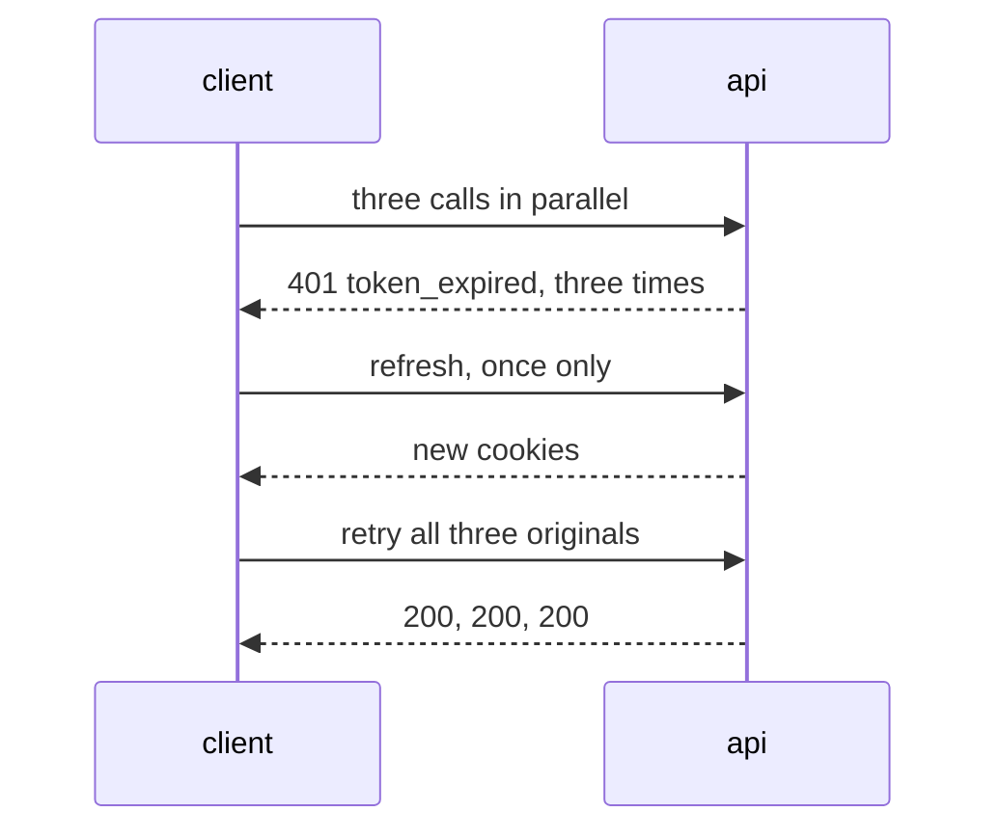

Proves: exactly one refresh call, all three originals retried once each,
nothing retried twice, and no sign out reported, so the parent sees no
interruption.

```sh
npm test -- src/tests/simulation_f09_silent_refresh.test.ts
```

<br>

### F10: hard sign out on a reused token

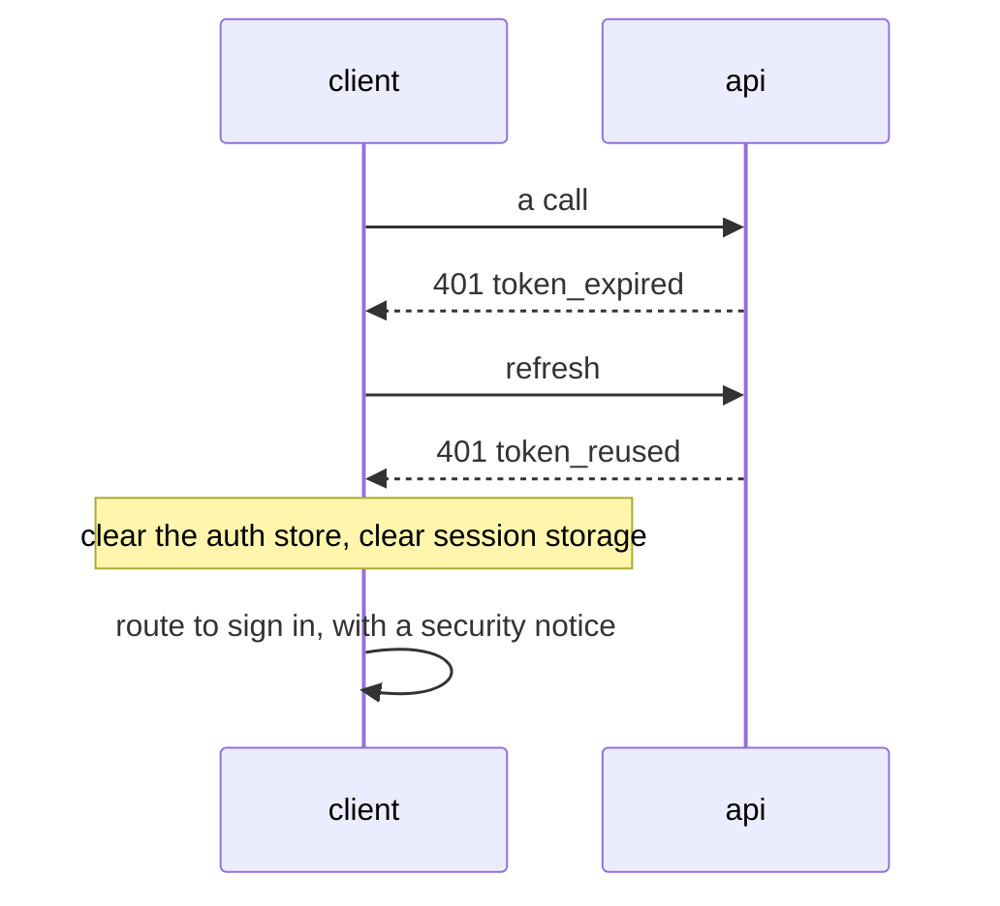

Proves: no retry loop, the auth store and the whole of `sessionStorage`
cleared, and the reason surviving so the sign-in screen can state it.

```sh
npm test -- src/tests/simulation_f10_hard_sign_out.test.ts
```

<br>

### F11: the roster view

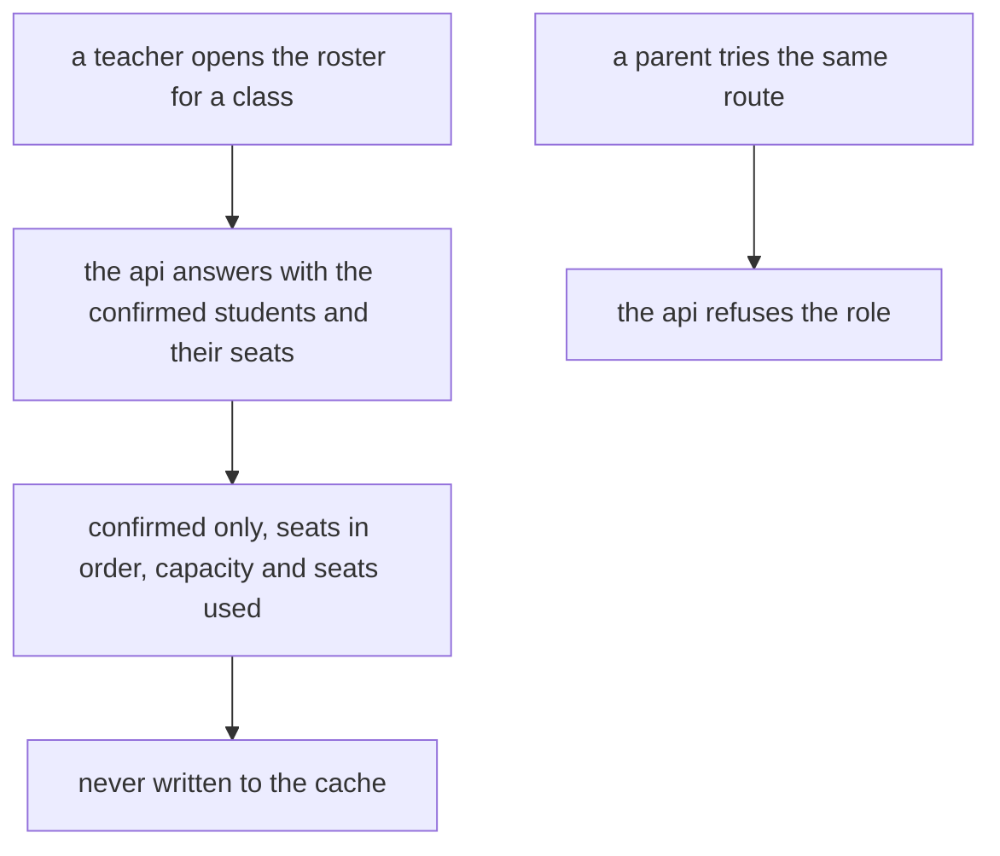

Proves: only `confirmed` bookings appear, seat numbers render in order, the
roster is never cached, a parent is refused by the api rather than by a hidden
link, and a class with nobody confirmed says so rather than rendering an empty
table. This is the only screen that puts a child's name next to a seat,
so a cached copy would be the one place in the browser where another family's
name outlives the screen that showed it.

```sh
npm test -- src/tests/simulation_f11_roster_view.test.ts
```

<br>

### F12: a fresh cache sends no request

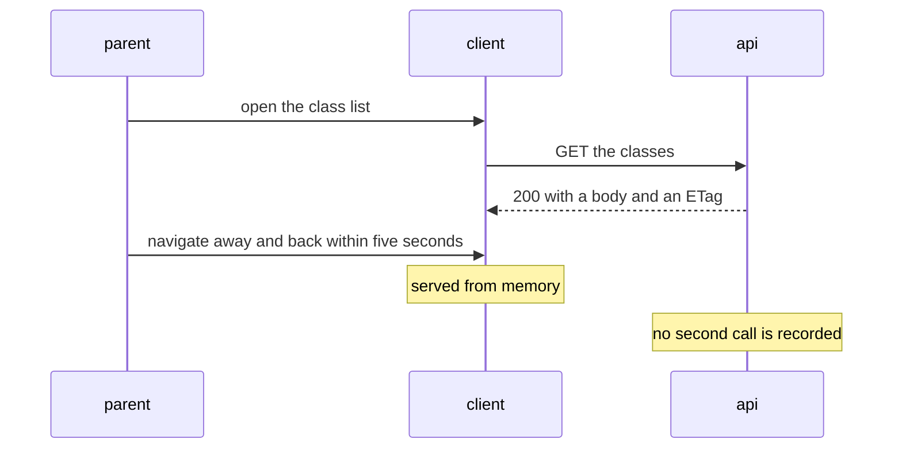

Proves: exactly one call, an identical rendered list, and the lookup reporting
itself as fresh.

```sh
npm test -- src/tests/simulation_f12_fresh_cache.test.ts
```

<br>

### F13: a stale cache revalidates to a 304

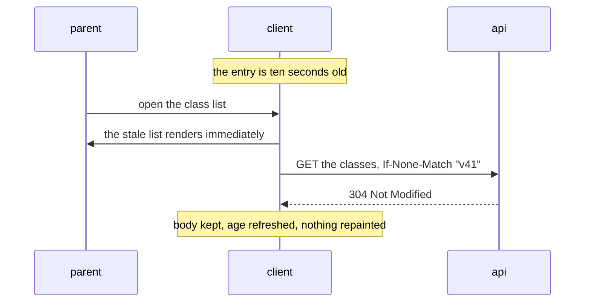

Proves: the stale body is returned before the request resolves, the request
carries the stored tag, the 304 does not replace the body, subscribers are not
needlessly notified, and the entry is fresh again afterwards.

```sh
npm test -- src/tests/simulation_f13_stale_revalidation.test.ts
```

<br>

### F14: a mutation invalidates the cache

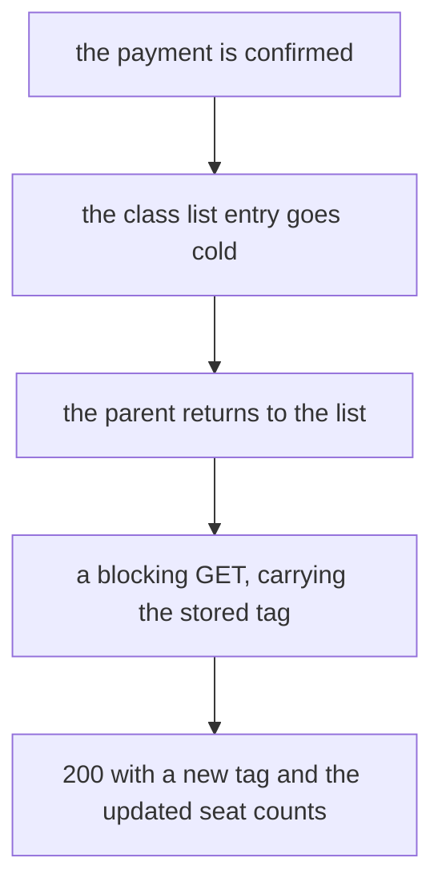

Proves: the entry stops being usable at the moment the mutation succeeds, the
next read is not served from memory, and the new seat count is what the parent
sees. A mutation that failed changes nothing, because nothing is known to have
changed.

```sh
npm test -- src/tests/simulation_f14_mutation_invalidates.test.ts
```

<br>

### F15: the status route reflects backend readiness

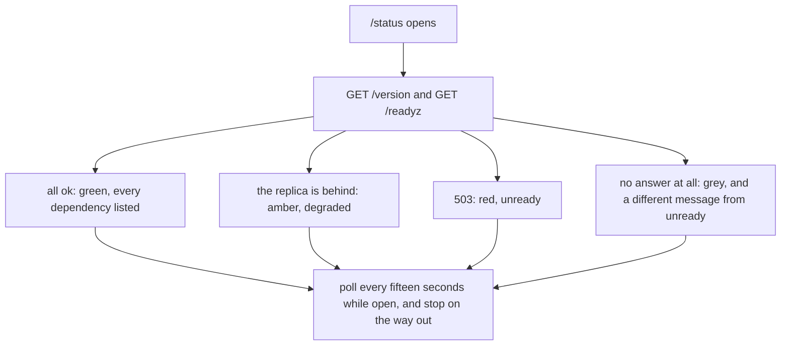

Proves: the build identity renders from `/version`, each dependency renders its
own row, amber reads differently from red, and the polling stops when the route
is left. A replica that has fallen behind costs a class list some accuracy and
costs nobody a seat, so showing it as an outage would send somebody looking for
a problem that is not costing anything.

```sh
npm test -- src/tests/simulation_f15_status_route.test.ts
```

<br>

### F16: nothing sensitive is held by the client

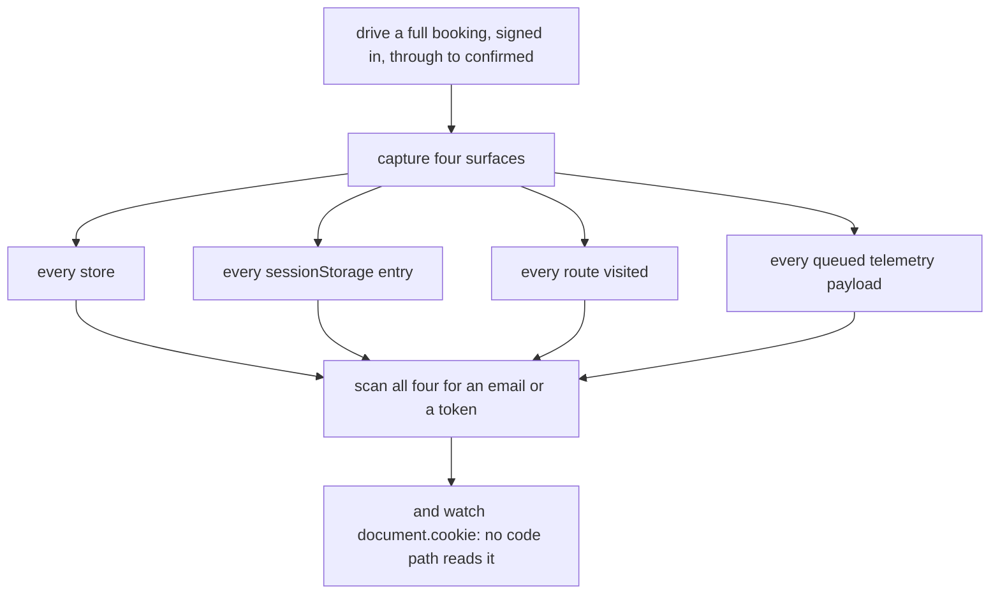

Proves: the seeded email appears in no store, no storage entry, no url, and no
telemetry payload, and a sign out leaves nothing of the previous parent behind.
A client that never reads a token cannot leak one however
badly it is written, which is why the case watches `document.cookie` rather
than trusting that nobody wrote the line.

```sh
npm test -- src/tests/simulation_f16_nothing_held.test.ts
```

<br>

### F17: the backend transaction broke mid-payment

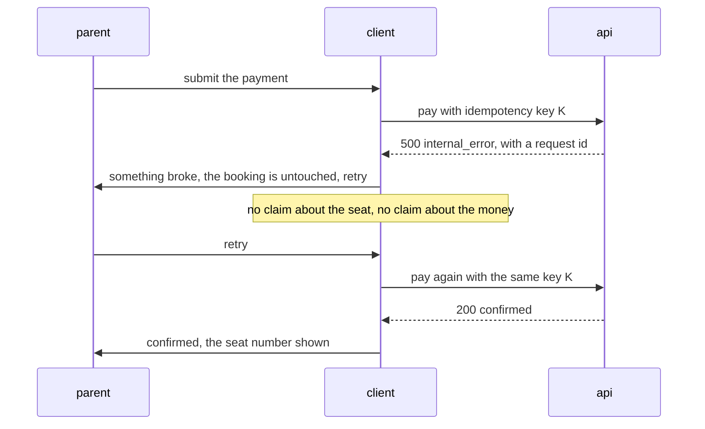

The client half of backend test 15. Proves: the message never says the
seat was lost and never says the payment was declined, the booking stays on
screen as pending, the countdown keeps running because the hold was not
touched, the cached list is left alone because nothing is known to have
changed, the retry reuses the same key, and the request id is rendered for
quoting. A declined payment is a finished attempt and earns a
fresh key, as in F3. An `internal_error` is an attempt of unknown outcome, so
the same key must go back or a retry risks charging twice.

```sh
npm test -- src/tests/simulation_f17_transaction_broke.test.ts
```

<br>

## Every Other Test, By Folder

One line per file: the tiers its own cases declare, what it covers, and the
command for that file alone. The tests above are not repeated here.

### src/lib/api

```sh
# errors.test.ts (unit, edge): the whole backend error table, an unknown code, a
# missing envelope, and wording that leaks nothing
npm test -- src/lib/api/errors.test.ts

# transport.test.ts (unit, edge): credentials, url building, headers, a 204, and a
# body that is not json
npm test -- src/lib/api/transport.test.ts

# client.test.ts (unit, edge, integration, behaviour): the request pipeline, one retry,
# never a loop, login never refreshing, and the conditional request
npm test -- src/lib/api/client.test.ts

# refresh.test.ts (unit, edge): single flight, one report per failure, and a cleared
# in-flight promise
npm test -- src/lib/api/refresh.test.ts

# idempotency.test.ts (unit, edge): uniqueness, length, and the fallback still being random
npm test -- src/lib/api/idempotency.test.ts

# attempt.test.ts (unit, edge, behaviour): which kinds of failure spend a key, and an
# unknown kind keeping it
npm test -- src/lib/api/attempt.test.ts
```

### src/lib/cache

```sh
# policy.test.ts (unit, edge): the three freshness tiers, both boundaries, and an entry
# dated in the future
npm test -- src/lib/cache/policy.test.ts

# key.test.ts (unit, edge): what the cache may hold, and two query strings never colliding
npm test -- src/lib/cache/key.test.ts

# store.test.ts (unit, edge, integration): save, touch, invalidate, clear, who is notified,
# and surviving a reload
npm test -- src/lib/cache/store.test.ts

# read_through.test.ts (edge, integration): all four lookup results, a swallowed background
# failure, and a shared revalidation
npm test -- src/lib/cache/read_through.test.ts

# mutation.test.ts (unit, edge, integration): a success invalidates, a failure does not
npm test -- src/lib/cache/mutation.test.ts

# session_mirror.test.ts (unit, edge): a round trip, the namespace, a storage that throws,
# and an entry that will not parse
npm test -- src/lib/cache/session_mirror.test.ts
```

### src/lib/stores

```sh
# auth.test.ts (unit, edge): what the auth store holds, and what it drops
npm test -- src/lib/stores/auth.test.ts

# classes.test.ts (unit, edge, integration): the path read, the freshness tier reported,
# and a failed read leaving the list alone
npm test -- src/lib/stores/classes.test.ts

# booking.test.ts (unit, edge, integration): one key across both calls, a fresh key per
# attempt, and a duplicate carrying the booking that exists
npm test -- src/lib/stores/booking.test.ts

# bookings.test.ts (unit, edge, integration, behaviour): an empty answer told apart from
# one never asked for, and a failed read leaving the list alone
npm test -- src/lib/stores/bookings.test.ts

# roster.test.ts (unit, edge, integration, behaviour): a refusal for the role told apart
# from any other failure, and a failed read clearing the names
npm test -- src/lib/stores/roster.test.ts

# status.test.ts (unit, edge, integration, behaviour): polling that stops, a 503 read as an
# answer, and degraded distinguished from unavailable
npm test -- src/lib/stores/status.test.ts
```

### src/lib/components

```sh
# ClassCard.test.ts (unit, edge, integration): zero seats, capacity taken, a negative count,
# one seat left, and the actions being the last block in the card
npm test -- src/lib/components/ClassCard.test.ts

# ChildPicker.test.ts (unit, edge, integration): every child offered, one preselected, and
# none on an empty account
npm test -- src/lib/components/ChildPicker.test.ts

# PasswordField.test.ts (unit, edge, integration, behaviour): hidden to begin with, revealed
# and hidden again, the typed value surviving both, and a control that does not submit
npm test -- src/lib/components/PasswordField.test.ts

# PaymentForm.test.ts (unit, edge, integration, behaviour): one field only, the honeypot sent
# as it stands, and the challenge token carried
npm test -- src/lib/components/PaymentForm.test.ts

# CaptchaWidget.test.ts (edge, integration, behaviour): one token, the unanswered state, and
# no callback after unmount
npm test -- src/lib/components/CaptchaWidget.test.ts

# HoldCountdown.test.ts (edge, integration, behaviour): the label moving with the clock, a past
# or missing deadline reading as ended, zero reported once rather than on every tick, and a
# suspended tab correct on its first frame back
npm test -- src/lib/components/HoldCountdown.test.ts

# BookingActions.test.ts (unit, edge, integration, behaviour): buttons rather than links, only
# a hold cancellable, two presses to cancel, and a second press ignored
npm test -- src/lib/components/BookingActions.test.ts

# BookingStatus.test.ts (edge, integration, behaviour): all six statuses, the seat shown only
# when won, the class named as the heading, and the block left out when it could not be read
npm test -- src/lib/components/BookingStatus.test.ts

# ReadinessDot.test.ts (unit, edge, behaviour): the three states, the fourth for no answer,
# and the state readable without the colour
npm test -- src/lib/components/ReadinessDot.test.ts

# VersionFooter.test.ts (unit, edge): the version and the commit injected at build time, a long
# commit shortened to seven characters, and nothing else carried
npm test -- src/lib/components/VersionFooter.test.ts
```

### src/lib/session, src/lib/booking, src/lib/config, src/lib/telemetry

```sh
# session/sign_out.test.ts (unit, edge, integration): store cleared, cache cleared, storage
# cleared, stores reset, navigation requested
npm test -- src/lib/session/sign_out.test.ts

# session/sign_out_request.test.ts (edge, integration, behaviour): the api told first, nothing
# left behind, and a refused logout still clearing this device
npm test -- src/lib/session/sign_out_request.test.ts

# session/restore.test.ts (edge, integration, behaviour): a tab with cookies getting its parent
# back, and a first visit never being told a session ended
npm test -- src/lib/session/restore.test.ts

# booking/countdown.test.ts (unit, edge): minutes and seconds at a fixed width, a deadline
# exactly now already expired, and a past, absent, or unparseable one reading as expired
# rather than as a negative or as NaN
npm test -- src/lib/booking/countdown.test.ts

# booking/cancel_request.test.ts (edge, integration, behaviour): the delete the api registered,
# the seat count dropped, and a refusal reaching the caller
npm test -- src/lib/booking/cancel_request.test.ts

# booking/bot_signals.test.ts (unit, edge): a real measurement, a backwards clock, and a
# rounded fraction
npm test -- src/lib/booking/bot_signals.test.ts

# config/api_base_url.test.ts (unit, edge, integration, behaviour): the loopback pair aligned
# both ways, and a real address left alone
npm test -- src/lib/config/api_base_url.test.ts

# config/build_identity.test.ts (unit, edge, behaviour): the manifest version, the short commit,
# and what each answers where neither exists
npm test -- src/lib/config/build_identity.test.ts

# config/environment.test.ts (unit, edge, behaviour): the api base url and the build identity
# arriving from the build, an unset variable falling back to the local value, and an unnamed
# build still saying which code it is
npm test -- src/lib/config/environment.test.ts

# telemetry/emitter.test.ts (unit, edge, integration): batching, a swallowed failure, no retry,
# the cap, and an idle emitter scheduling nothing
npm test -- src/lib/telemetry/emitter.test.ts

# telemetry/page_load.test.ts (unit, edge, integration): the gap rather than the mount, one
# report per screen, and a pattern rather than a path
npm test -- src/lib/telemetry/page_load.test.ts
```

### src/routes

```sh
# layout.test.ts (unit, edge, integration): the header shell, the control shown only to
# somebody signed in, a second press ignored, and the session asked for once on mount
npm test -- src/routes/layout.test.ts

# page.test.ts (edge, integration): the class list renders, a full class offers no way in,
# and a failed read says so
npm test -- src/routes/page.test.ts

# sign-in/page.test.ts (edge, integration, behaviour): the screen, including the notice after
# a reused token
npm test -- src/routes/sign-in/page.test.ts

# book/[classId]/page.test.ts (edge, integration): a hold moves on, and a full class or a
# duplicate is answered on the screen
npm test -- 'src/routes/book/[classId]/page.test.ts'

# pay/[bookingId]/page.test.ts (edge, integration, behaviour): the booking read on arrival, a
# settled payment moving on, a decline offering a retry, a lost seat being terminal, an
# internal_error claiming nothing, and the countdown reaching zero closing the control
npm test -- 'src/routes/pay/[bookingId]/page.test.ts'

# booking/[bookingId]/page.test.ts (edge, integration, behaviour): the status read from the
# api, a hold given up, and the booking read again afterwards
npm test -- 'src/routes/booking/[bookingId]/page.test.ts'

# bookings/page.test.ts (edge, integration, behaviour): a pending payment and a completed one
# told apart, and the empty state never standing in for a failure
npm test -- src/routes/bookings/page.test.ts
```

<br>

## The Script Guards

The scripts have tests of their own. They read their subject or stop inside a
guard, so none of them starts or removes anything:

```sh
scripts/debug_test.sh
scripts/clean_test.sh
```

The repository-wide guards, for the scripts under the root `scripts/`, are
listed in the root `how-to.md` under Run Every Test.

<br>

## Where Else Tests Are Described

| document | what it holds |
| :- | :- |
| `how-to.md` | the whole-suite commands, and Writing A Test |
| `HLD.md` | Testing, why every test drives a fake transport |
| `LLD.md` | Tests, the same file list with what each one covers |
| `phase-track.md` | which phase each test landed in |
