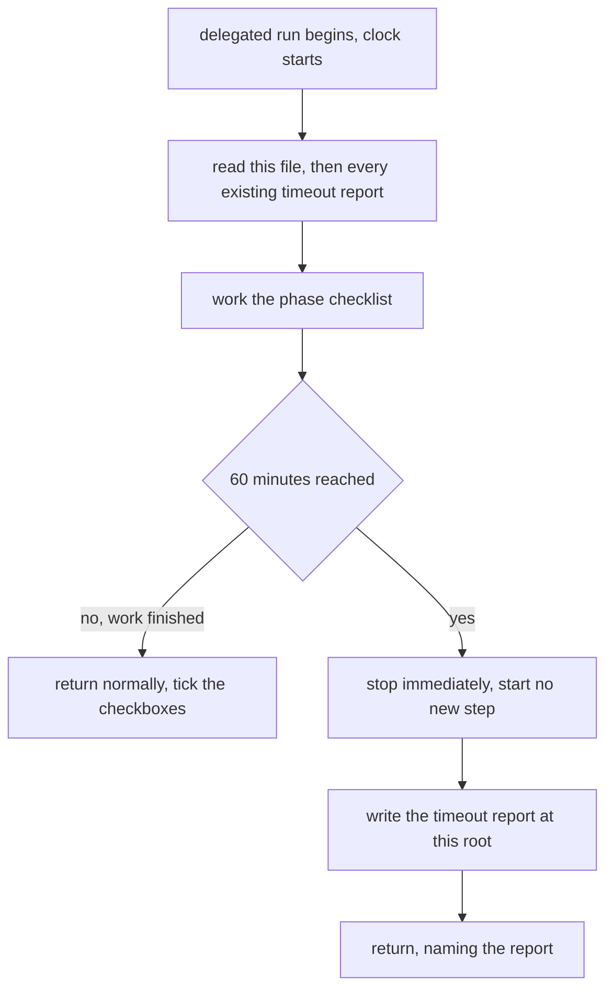

# Work Rules

How work is allowed to arrive in this repository. This file is the rule. The two
stacks restate it rather than redefining it, so the number below is changed here
and nowhere else.

 

## Why This Exists

Work lands one phase at a time, ticked off as it goes. The failure this guards
against is a single run that disappears for hours and comes back with a sweeping
change: nobody can review it in one sitting, the phase checkboxes stop meaning
anything, and a surprise rewrite looks exactly like progress.

A ceiling forces the work back into the open at a known point, finished or not.
An incremental approach or waterfall methodology approach: a phase is picked up,
worked, and handed back, and it closes before the next one opens. Work that
cannot fit in one run is split in the plan rather than pushed through in one go.

 

## The Ceiling

Two delegated runs are allowed on this project, one for the backend and one for
the frontend. Each carries a hard ceiling of 60 minutes of processing, counted
per run rather than per step. It was 30 until the developer raised it on
2026-08-12.

| rule | detail |
| :- | :- |
| how many | two delegated runs, one per stack |
| ceiling | 60 minutes of processing per run, not per step |
| on reaching it | stop, start nothing new, and attempt no partial fix on the way out |
| before starting | read this file, then every existing timeout report, so the same wall is not walked into twice |
| who it binds | a delegated run. Somebody working by hand is not on a clock, but reads this so they know what a returning run was allowed to do |

 

## The Timeout Report

A run that reaches the ceiling writes one before returning anything else.

| field | value |
| :- | :- |
| name | `AGENT-TIMEOUT-<STACK>-REPORT-YYYY_MM_DD_hh_mm_ss.md`, stack in upper case (`BACKEND` or `FRONTEND`), every field zero padded |
| when | the timestamp is taken at the moment the ceiling was hit, not when the file is written |
| where | this repository root, beside `README.md`, never inside a stack |
| not ignored | deliberately absent from every `.gitignore`. A stalled run has to be impossible to miss, by the developer and by whoever picks the work up next |

The report records one run. Progress still lives in the phase checkboxes.

| section | contents |
| :- | :- |
| scope | what the run was asked to do, and which phase it was working |
| finished | what is complete and verified, with the checkbox lines that can be ticked |
| in flight | what was mid-change when the clock ran out, named file by file, and whether each one is in a consistent state |
| commands | what was run and what each one exited with, including the failing output verbatim |
| blocked | anything waiting on a decision, a credential, or a container that would not start |
| remaining | what is left in the phase, in the order it should be picked up |
| suspected cause | why this run overran, stated as a suspicion when that is what it is |

An overrun says something about the plan, not only about the run. A phase that
keeps producing reports was cut too wide, and the fix is to split the phase
rather than to raise the ceiling.

 

## When The Ceiling Changes

The number here is the only one that counts, and it is allowed to change. What is
not allowed is a run acting on a number it remembers.

| after a change | what has to happen |
| :- | :- |
| any run, before starting | read this file again, even after having read it before. A rule read last week is not the rule |
| a tool holding this in memory | treat the remembered value as stale, re-read this file, and correct the stored note to match what is written here |
| the two stack copies | `backend/work-rules.md` and `frontend/work-rules.md` are updated in the same change, so no copy is left stating an old number |

A remembered rule is a cache of this file. This file is the source, and when the
two disagree, this file is right.

 

## Further Reading

| file | contents |
| :- | :- |
| `backend/work-rules.md` | the short version a backend run reads |
| `frontend/work-rules.md` | the short version a frontend run reads |
| `backend/phase-track.md` | the backend phases, with the checkboxes a run ticks |
| `frontend/phase-track.md` | the frontend phases, same shape |
